# บทสาธิตระบบ ULMs แบบกดหน้าเว็บจริง — 25 ก.ย. 2569 เวลา 13:00

สาธิต 20–30 นาที ครบทุกบทบาท บนข้อมูลที่มีการใช้งานย้อนหลัง 6 สัปดาห์
ทุกขั้นในไฟล์นี้ซ้อมกดจริงแล้วเมื่อ 25 ก.ย. 03:00–03:20 ผ่านทุกขั้น (ผลแต่ละขั้นเขียนไว้ใต้ขั้นนั้น)

- โค้ด: `~/Projects/ulms-demo` คือ `origin/main` ที่ `e0a4865` แตกออกมาด้วย `git archive` ไม่ใช่ git checkout
  ทีม push อะไรเพิ่มระหว่างวันก็ไม่กระทบเครื่องสาธิต
- ฐานข้อมูล: `ulms_demo5` (แยกจาก `app` ของทีม และจาก `ulms_demo3` `ulms_demo4` ของรอบก่อน)
- ข้อมูล: สร้างด้วย `seed_rich_demo.py` ผลรอบล่าสุดอยู่ใน `rich-demo-state.json`

---

## 0. ภาพรวมเส้นทาง

```mermaid
flowchart LR
  A0["เตรียมเครื่อง<br/>T-30 นาที"]
  subgraph core["วงจรยืมคืนหลัก 15 นาที"]
    A1["1 ผู้ยืม<br/>ส่งคำขอ T0 และ T2"]
    A2["2 อาจารย์<br/>อนุมัติ และปฏิเสธ"]
    A3["3 เจ้าหน้าที่<br/>จัดเตรียม สลับเครื่อง ส่งมอบ"]
    A4["4 ผู้ยืม<br/>รับของพร้อมรูป"]
    A5["5 เจ้าหน้าที่<br/>รับคืนพร้อมรูป ตรวจ B1"]
    A6["6 อุทธรณ์<br/>ผู้ยืมยื่น อาจารย์ลดโทษ"]
  end
  A7["7 ต่อเวลา<br/>T0 ทันที T2 รออาจารย์"]
  A8["8 จองห้อง T3<br/>วันนี้"]
  A9["9 งานเจ้าหน้าที่<br/>แบน ซ่อม สถิติ CSV"]
  A10["10 ผู้ดูแลระบบ<br/>ภาพรวม บันทึก cron"]
  A11["11 สมัครสมาชิก<br/>อีเมลยืนยัน"]
  A0 --> A1 --> A2 --> A3 --> A4 --> A5 --> A6
  A6 --> A7 --> A8 --> A9 --> A10 --> A11
```



| องก์ | เรื่อง | หน้าต่าง | เวลา | ถ้าเวลาไม่พอ |
|---|---|---|---|---|
| 1 | ส่งคำขอยืม | ผู้ยืม | 3 นาที | ต้องมี |
| 2 | อนุมัติและปฏิเสธ | อาจารย์ | 2 นาที | ต้องมี |
| 3 | จัดเตรียม สลับเครื่อง ส่งมอบ | เจ้าหน้าที่ | 3 นาที | ข้ามการสลับเครื่องได้ |
| 4 | รับของพร้อมรูป | ผู้ยืม | 2 นาที | ต้องมี |
| 5 | รับคืน ตรวจสภาพ หักเครดิต | เจ้าหน้าที่ | 3 นาที | ต้องมี |
| 6 | อุทธรณ์ | ผู้ยืม แล้วอาจารย์ | 2 นาที | ต้องมี |
| 7 | ต่อเวลา | ผู้ยืม แล้วอาจารย์ | 2 นาที | ข้ามได้ |
| 8 | จองห้อง | ผู้ยืม แล้วอาจารย์ | 2 นาที | ข้ามได้ |
| 9 | งานเจ้าหน้าที่ | เจ้าหน้าที่ | 3 นาที | เลือกทำ 1–2 หน้า |
| 10 | ผู้ดูแลระบบ | ผู้ดูแล | 2 นาที | เปิดแค่ภาพรวม |
| 11 | สมัครสมาชิก | หน้าต่างส่วนตัว | 2 นาที | ข้ามได้ |

รวมหลัก (1–6) ราว 15 นาที ครบทั้งหมดราว 26 นาที

**ลำดับนี้ตั้งใจ** องก์ 1→6 ใช้ของชิ้นเดียวกันต่อกันเป็นเรื่องเดียว คือคำขอที่เพิ่งส่งเดินไปจนถึงอุทธรณ์
ถ้ากดข้ามลำดับ เช่นตรวจสภาพก่อนรับคืน ปุ่มจะไม่มีให้กด

---

## 1. เตรียมเครื่อง (T-30 นาที)

### 1.1 เปิดระบบ

```bash
cd ~/Projects/SoftwareEn
bash docs/demo/start_rich_demo.sh      # Postgres + Mailpit + backend :3000 + frontend :5173
```

ถ้าขึ้นว่า `port 3000 is already in use` แปลว่าระบบเปิดค้างอยู่แล้ว ข้ามขั้นนี้ได้

### 1.2 รีเซ็ตข้อมูลให้เป็นสภาพเริ่มต้น (ต้องทำทุกครั้งหลังซ้อม)

```bash
bash docs/demo/reset_rich_demo.sh      # ราว 2 นาที ต้องเปิด backend ไว้ก่อน
```

บรรทัดสุดท้ายต้องขึ้น

```
== done in 101s  queue counts {'toPrepare': 10, 'toHandover': 5, 'onLoan': 18, 'overdue': 4, 'toInspect': 4, ...}
```

ตัวเลขต่างจากนี้ได้เล็กน้อยถ้ารีเซ็ตคนละเวลา แต่ต้องไม่มี `Traceback`
รหัสเครื่อง หมายเลขครุภัณฑ์ และคีย์ในไฟล์นี้ได้ค่าเดิมทุกครั้งที่รีเซ็ต เพราะสคริปต์ใช้ random seed คงที่

### 1.3 เปิดเบราว์เซอร์ 4 บทบาท

คุกกี้ผูกกับโปรไฟล์ เปิดหลายแท็บในโปรไฟล์เดียวคือคนเดิม ล็อกอินทับจะเตะคนเดิมออก

```bash
bash docs/demo/open_demo_browsers.sh   # Firefox 4 หน้าต่าง คนละโปรไฟล์
```

| หน้าต่าง | ล็อกอิน | รหัสผ่าน | เปิดค้างไว้ที่ |
|---|---|---|---|
| ผู้ยืม | `test_borrower` | `borrower1234` | หน้าแรก |
| เจ้าหน้าที่ | `test_staff` | `staff1234` | คิวงาน |
| อาจารย์ | `test_supervisor` | `supervisor1234` | การอนุมัติ |
| ผู้ดูแลระบบ | `test_admin` | `admin1234` | ภาพรวมระบบ |

ทั้งหมดใช้แท็บ **บัญชีภายในระบบ** ในหน้าเข้าสู่ระบบ (แท็บแรกเป็นอีเมล KU)
องก์ 11 ใช้ **หน้าต่างส่วนตัว** อีกบาน และเปิด `http://localhost:8025` (Mailpit) ไว้หนึ่งแท็บ

### 1.4 ตั้งหน้าจอ

- **ซูมเบราว์เซอร์ 125%** (Ctrl +) ทุกหน้าต่าง อาจารย์ติงเรื่องตัวอักษรเล็ก หน้าจอจริงก็เช่นกัน
- เปิดโฟลเดอร์ `docs/demo/photos/` ไว้ ใช้ตอนแนบรูปในองก์ 4 และ 5
- ปิดการแจ้งเตือนของเครื่อง

### 1.5 ตรวจก่อนขึ้นเวที (1 นาที)

- [x] หน้าต่างผู้ยืม หน้าแรกขึ้น **2 ชิ้นที่กำลังยืม** (มัลติมิเตอร์ EE-DMM-005 และออสซิลโลสโคป EE-OSC-001)
- [x] หน้าต่างเจ้าหน้าที่ คิวงานขึ้น **รอจัดเตรียม 10 รอส่งมอบ 5 กำลังยืม 18 เกินกำหนด 4 รอตรวจสภาพ 4**
- [x] หน้าต่างอาจารย์ การอนุมัติขึ้น **รออาจารย์อนุมัติ 5 รอเจ้าหน้าที่อนุมัติ 3**
- [x] หน้าต่างผู้ดูแล ภาพรวมขึ้น **บัญชีผู้ใช้ 44 ทรัพยากร 96**

---

## 2. ข้อมูลที่เตรียมไว้ในฐาน

พูดได้ตรง ๆ ว่าข้อมูลนี้สร้างด้วยสคริปต์ เพื่อให้เห็นระบบตอนมีคนใช้จริง

| หมวด | จำนวน | ที่มา |
|---|---|---|
| ภาควิชา | 6 (คอมพิวเตอร์ ไฟฟ้า เครื่องกล โยธา เคมี อุตสาหการ) | SQL ตามโครงเดียวกับ `seed.ts` เพราะไม่มี API สร้างภาควิชา |
| ครุภัณฑ์ | 20 ประเภท 90 ชิ้น ครบ T0 T1 T2 | SQL ใส่พร้อมภาควิชาเพื่อความสะดวก (ระบบมี `item.createType` และ `item.createUnit` ใช้ได้จากหน้าคลังของเจ้าหน้าที่) |
| ห้อง T3 | 6 ห้อง | `item.createRoom` |
| ผู้ใช้ | 44 = นิสิต 31 เจ้าหน้าที่ 7 อาจารย์ 4 ผู้ดูแล 2 | `admin.createUser` |
| การยืมที่จบแล้ว | ราว 105 รายการ ย้อนหลัง 6 สัปดาห์ | tRPC จริงทุกขั้น แล้วเลื่อนเวลาย้อนหลัง |
| กำลังยืม | 18 รายการ เกินกำหนด 4 | tRPC |
| บทลงโทษ | 40 รายการ ยังมีผล 11 | ระบบคิดเองจากผลตรวจและการคืนช้า |
| อุทธรณ์ | รอตัดสิน 3 ตัดสินแล้ว 2 | tRPC |
| งานซ่อม | เปิดอยู่ 3 ปิดแล้ว 2 | tRPC |
| จองห้องวันนี้ | 6 ใบ อนุมัติแล้ว 3 | tRPC |
| ผู้ถูกระงับ | 1 คน (`6610500030` ปาริชาติ) | tRPC |

นิสิตที่สร้างใหม่ทุกคนรหัสผ่าน `demo1234` ล็อกอินด้วยรหัสนิสิต เช่น `6610500001`

**ข้อเดียวที่ตั้งค่าตรง** คือคะแนนเครดิตของนิสิต 4 คน (`6610500025`–`028` = 84 72 61 44)
เพื่อให้หน้าผู้ใช้เห็นครบทุกระดับ D0 ถึง D3 ถ้าถูกถามว่าทำไมเครดิตไม่ตรงกับประวัติ ให้ตอบตามนี้

### ของที่องก์ต่าง ๆ ใช้

| ใช้ในองก์ | ของ | สถานะเริ่มต้น |
|---|---|---|
| 1 | บอร์ด Arduino Uno R4 WiFi (T0) และแว่น VR Meta Quest 3 (T2) | ว่าง |
| 3 | บอร์ด Raspberry Pi `CPE-RPI-004` ของ `6610500002` | จัดเตรียมแล้ว รอส่งมอบ |
| 3 | เครื่องที่จะสลับไป `CPE-RPI-002` **รหัสภายใน 17** | ว่าง จองไว้ให้องก์นี้ |
| 4 | กล้อง DSLR `MM-CAM-003` และสายจัมเปอร์ `EE-JMP-005` ของผู้ยืม | จัดเตรียมแล้ว รอผู้ยืมมารับ |
| 5 | โน้ตบุ๊ก `CPE-NB-002` (T2 ที่ `test_staff` เป็นคนจัดเตรียม) | คืนแล้ว รอตรวจ |
| 6 | บทลงโทษกล้อง `MM-CAM-001` ของผู้ยืม −3 เมื่อ 23 ก.ย. | อุทธรณ์ได้ถึง 30 ก.ย. สำรองไว้ถ้าองก์ 5 พลาด |
| 7 | มัลติมิเตอร์ `EE-DMM-005` (T0) และออสซิลโลสโคป `EE-OSC-001` (T2) ของผู้ยืม | กำลังยืม ครบกำหนด 27 ก.ย. |
| 9 | `6610500030` ปาริชาติ | ถูกระงับ 14 วัน |

ผู้ยืมเริ่มที่ **เครดิต 89 ระดับ D1** เพราะโดนหัก 3 คะแนนจากกล้อง MM-CAM-001 เมื่อ 23 ก.ย. ใช้เป็นเรื่องเล่าตอนองก์ 5–6 ได้

---

## 3. บทสาธิต

แต่ละขั้นเขียนเป็น **กด** → **จะเห็น** และมี **พูด** สั้น ๆ ไว้ให้

### องก์ 1 — ผู้ยืมส่งคำขอ (หน้าต่างผู้ยืม 3 นาที)

**ต้องการให้เห็น** รายการครุภัณฑ์อ่านจากฐานจริง ขอหลายระดับในคำขอเดียว T0 ได้ทันที T2 ต้องรออาจารย์

1. หน้าแรก → ชี้ **2 ชิ้นที่กำลังยืม** กับ **ชิ้นถัดไปที่ถึงกำหนด 27 ก.ย.** และกระดิ่งแจ้งเตือนมุมขวา
   - พูด: หน้าแรกบอกของที่ถือ กำหนดคืน และการแจ้งเตือนจากระบบ
2. เมนูซ้าย **รายการครุภัณฑ์**
   - จะเห็น: 20 ประเภทจาก 6 ภาควิชา ตัวกรองภาควิชา ระดับ T0–T3 และคอลัมน์ **พร้อมยืม** เช่น 9 / 10
   - ตารางมี 3 หน้า ถ้าหาไม่เจอให้ใช้ช่องค้นหา
3. ช่วงเวลาด้านบน **วันรับ 29 ก.ย. วันคืน 2 ต.ค.**
   - พูด: ตัวเลขพร้อมยืมคำนวณตามช่วงเวลาที่เลือก ไม่ใช่จำนวนรวม
4. ช่องค้นหา พิมพ์ `Arduino` → **+ เพิ่ม** ที่ "บอร์ด Arduino Uno R4 WiFi"
5. ช่องค้นหา พิมพ์ `VR` → **+ เพิ่ม** ที่ "แว่น VR Meta Quest 3" (ป้าย T2 ต้องรออาจารย์อนุมัติ)
6. เมนูซ้าย **สร้างคำขอยืม** (ต้องกดเมนู อย่าพิมพ์ URL เอง ตะกร้าเก็บในหน้าเว็บ รีโหลดแล้วหาย)
   - จะเห็น: กล่องขวา **ตรวจก่อนส่ง** ขึ้นว่าต้องเลือกหมายเลขเครื่อง T2 ปุ่มส่งคำขอยังกดไม่ได้
7. ส่วน **เลือกหมายเลขเครื่อง (T2)** ติ๊ก `CPE-VR-001`
   - พูด: T2 ผู้ยืมเลือกเครื่องเอง อาจารย์อนุมัติเครื่องนั้น ส่วน T0–T1 ระบบเลือกให้
8. กด **ส่งคำขอ**
   - จะเห็น: ไปหน้า **คำขอของฉัน** Arduino ขึ้น **อนุมัติแล้ว** แว่น VR ขึ้น **รออนุมัติ** พร้อมแถบขั้นตอน
   - ซ้อมแล้ว: `loan.create` 200

### องก์ 2 — อาจารย์อนุมัติ (หน้าต่างอาจารย์ 2 นาที)

**ต้องการให้เห็น** คิวอนุมัติของจริง ปฏิเสธต้องมีเหตุผล และผู้ยืมเห็นเหตุผลนั้น

1. รีเฟรชหน้า **การอนุมัติ**
   - จะเห็น: การ์ดนับ **รออาจารย์อนุมัติ 6** **ระบบอนุมัติเองวันนี้** และตาราง T2 ของนิสิตหลายคน รวมห้อง T3
2. แถว **Natthawut Srisuwan แว่น VR CPE-VR-001** → **อนุมัติ**
3. แถว **ปัณณวิชญ์ เครื่องพิมพ์ 3 มิติ ME-3DP-002** → **ปฏิเสธ**
   - จะเห็น: ช่องเหตุผลขึ้นในแถว ปุ่ม **ยืนยันปฏิเสธ** ยังกดไม่ได้
   - พิมพ์ `เครื่องพิมพ์ 3 มิติต้องใช้ใน Maker Space เท่านั้น` → **ยืนยันปฏิเสธ**
   - พูด: ข้อความนี้เก็บแยกจากเหตุผลของผู้ยืม และผู้ยืมเห็นข้อความจริงที่อาจารย์พิมพ์
4. (ถ้ามีเวลา) กดแท็บ **ขอต่อเวลา** ให้เห็นคำขอต่อเวลา `CPE-NB-004` ที่รออยู่ ยังไม่ต้องกด

### องก์ 3 — เจ้าหน้าที่จัดเตรียม สลับเครื่อง ส่งมอบ (หน้าต่างเจ้าหน้าที่ 3 นาที)

**ต้องการให้เห็น** ตัวนับคิวเดินตามจริง และหน้ารายละเอียดที่สลับเครื่อง T1 ได้

1. รีเฟรชหน้า **คิวงาน** ชี้การ์ดทั้ง 6 ช่อง
   - พูด: ทุกตัวเลขมาจาก `loan.queueCounts` อัปเดตเองทุก 30 วินาที
2. ช่องค้นหาในคิว พิมพ์ `Natthawut`
   - จะเห็น: Arduino และแว่น VR อยู่แท็บ **รอจัดเตรียม**
3. กด **จัดเตรียม** ทั้งสองแถว (ไม่มีกล่องยืนยัน กดแล้วย้ายทันที)
   - ซ้อมแล้ว: `loan.allocate` 200 ทั้งสองชิ้น
4. ล้างช่องค้นหา → การ์ด **รอส่งมอบ**
5. **คลิกที่ชื่ออุปกรณ์ในแถว** `CPE-RPI-004` ของพิมพ์ชนก (คลิกแถว ไม่ใช่ปุ่มส่งมอบ)
   - จะเห็น: หน้า **ส่งมอบ/รับคืน** รายละเอียดการยืมหนึ่งรายการ
6. ช่อง **รหัสหน่วยใหม่** พิมพ์ `17` เหตุผล `ผู้ยืมขอเครื่องที่มีพัดลมระบายความร้อน` → **ยืนยันการสลับ**
   - จะเห็น: บรรทัดเครื่องเปลี่ยนเป็น **CPE-RPI-002** และแถบ "สลับหน่วยอุปกรณ์เรียบร้อยแล้ว"
   - พูด: สลับได้เฉพาะ T1 ก่อนส่งมอบ T0 กับ T2 ระบบไม่ยอม
   - **ข้อควรรู้** ช่องนี้รับรหัสภายใน (17) ยังไม่รับหมายเลขครุภัณฑ์ ถ้าถูกถามให้ยอมรับว่าเป็นจุดที่จะแก้
7. **กลับไปที่คิว** → การ์ด **รอส่งมอบ** → แถว `CPE-RPI-002` กด **ส่งมอบ**
   - ซ้อมแล้ว: `loan.confirmPickup` 200

### องก์ 4 — ผู้ยืมรับของพร้อมรูป (หน้าต่างผู้ยืม 2 นาที)

**ต้องการให้เห็น** ผู้ยืมต้องถ่ายรูปสภาพของทุกชิ้นก่อนยืนยันรับ รูปเก็บเป็นหลักฐาน

1. เมนูซ้าย **รับของ**
   - จะเห็น: รายการที่จัดเตรียมแล้ว 4 ชิ้น **ถูกติ๊กไว้ทุกชิ้น**
2. **เอาติ๊กออก** ที่แว่น VR กับ Arduino ให้เหลือ **กล้อง DSLR MM-CAM-003** กับ **สายจัมเปอร์ EE-JMP-005**
   - จะเห็น: ส่วนถ่ายรูปเหลือ 2 ช่อง ขึ้น "ยังถ่ายรูปไม่ครบ เหลืออีก 2 ชิ้น" ปุ่มยืนยันกดไม่ได้
3. ช่อง **สายจัมเปอร์** → เลือกไฟล์ `docs/demo/photos/jumper-before.jpg`
4. ช่อง **กล้อง DSLR** → เลือกไฟล์ `docs/demo/photos/camera-before.jpg`
5. กด **ยืนยันรับของ**
   - จะเห็น: ไปหน้าคำขอของฉัน ทั้งสองชิ้นเป็น **กำลังยืม**
   - ซ้อมแล้ว: ขอที่อัปโหลด 200 → PUT ไฟล์ → แนบรูป 200 → `loan.confirmMyPickup` 200 ครบ 2 ชิ้น
   - พูด: รอบก่อนปุ่มนี้เรียก API ที่ไม่มีอยู่ ได้ 404 ตอนนี้ครบทั้งวงจร

### องก์ 5 — รับคืน ตรวจสภาพ หักเครดิต (หน้าต่างเจ้าหน้าที่ 3 นาที)

**ต้องการให้เห็น** คืนต้องมีรูป ผลตรวจบอกล่วงหน้าว่าจะหักเท่าไร และกฎคนจัดเตรียมห้ามตรวจเอง

1. **คิวงาน** → การ์ด **กำลังยืม** → ค้นหา `MM-CAM-003`
   - จะเห็น: ปุ่ม **รับคืน** จาง กดไม่ได้
2. **ถ่ายรูปตอนรับคืน** → ไฟล์ `camera-after.jpg` (รูปที่มีรอยขีด)
   - จะเห็น: ปุ่มรับคืนกดได้แล้ว → กด **รับคืน**
   - พูด: backend ก็บังคับเอง คืนโดยไม่มีรูปได้ 412 RETURN_PHOTO_REQUIRED ไม่ได้พึ่งปุ่ม
3. เมนูซ้าย **ตรวจสภาพ**
   - จะเห็น: รายการรอตรวจ 5 ชิ้น
4. เปิด **กล้องถ่ายภาพ DSLR MM-CAM-003**
   - จะเห็น: รูปตอนรับกับตอนคืนวางคู่กัน และประวัติของกล้องชิ้นนี้
5. เลือก **B1** → จะเห็น **"จะหักเครดิตประมาณ 3 คะแนนจาก Natthawut Srisuwan (ปัจจุบัน 89)"** → **บันทึกผลตรวจ**
   - ซ้อมแล้ว: `inspection.create` 200 เครดิตผู้ยืม 89 → 86
6. กฎแยกหน้าที่ เปิด **โน้ตบุ๊ก Dell CPE-NB-002** (T2 ที่ test_staff เป็นคนจัดเตรียม) → **B0** → **บันทึกผลตรวจ**
   - จะเห็น: ข้อความ `CANNOT_INSPECT_OWN_PREPARATION` ใต้ปุ่ม
   - พูด: T2 คนจัดเตรียมกับคนตรวจต้องเป็นคนละคน backend ปฏิเสธ 403 เอง **ข้อความยังไม่ได้แปลเป็นไทย** อยู่ในรายการแก้
   - ถ้าข้ามข้อนี้ ไม่กระทบองก์ถัดไป

### องก์ 6 — อุทธรณ์ (ผู้ยืม แล้วอาจารย์ 2 นาที)

**ต้องการให้เห็น** ผู้ยืมโต้แย้งผลตรวจได้ อาจารย์ตัดสินโดยดูรูปคู่ และเครดิตคืนจริง

1. หน้าต่างผู้ยืม → เมนูซ้าย **การอุทธรณ์**
   - จะเห็น: รายการที่อุทธรณ์ได้ 2 ชิ้น ตัวที่เพิ่งโดน (**MM-CAM-003 −3 วันนี้**) กับตัวเมื่อ 23 ก.ย.
2. เลือก **MM-CAM-003** → เหตุผล `รอยขีดข่วนมีอยู่ตั้งแต่ตอนรับ ดูได้จากรูปตอนรับของ` → **ส่งเรื่องอุทธรณ์**
   - ซ้อมแล้ว: `appeal.create` 200
3. หน้าต่างอาจารย์ → เมนูซ้าย **อุทธรณ์**
   - จะเห็น: การ์ดรอตัดสิน 4 ใบ **ใบของ Natthawut อยู่ล่างสุด** เลื่อนลงไป
   - จะเห็น: คำชี้แจงของผู้ยืม และ **หลักฐานประกอบ รูปตอนรับของกับตอนคืน**
4. ช่อง **คงการหักเครดิตไว้ที่** พิมพ์ `1` (ขึ้นว่า "คืนเครดิต 2 คะแนน") → กด **อนุมัติ** ในการ์ดใบนั้น
   - ระวัง: ปุ่มอนุมัติมีทุกการ์ด กดของใบล่างสุดเท่านั้น
   - ซ้อมแล้ว: `appeal.decide` 200 เครดิต 86 → 88
5. หน้าต่างผู้ยืม รีเฟรชหน้าแรก ให้เห็นแจ้งเตือนผลอุทธรณ์ที่กระดิ่ง

### องก์ 7 — ขอต่อเวลา (ผู้ยืม แล้วอาจารย์ 2 นาที)

**ต้องการให้เห็น** T0 ต่อได้ทันที T2 ต้องรออาจารย์ และหน้าจอบอกผลก่อนกด

1. หน้าต่างผู้ยืม **คำขอของฉัน** → แท็บ **กำลังยืม**
   - จะเห็น: การ์ดแต่ละชิ้นบอก "เหลืออีก 2 วัน ต่อได้ทันที เหลือสิทธิ์ต่อเวลาอีก 2 ครั้ง"
     หรือ "ต่อเวลาต้องให้อาจารย์ผู้ดูแลอนุมัติ"
2. การ์ด **มัลติมิเตอร์ EE-DMM-005** → **ขอต่อเวลา**
   - จะเห็น: "กำหนดคืนใหม่ 7 ต.ค. 2569 16:00" → **ยืนยัน ต่อเวลาเลย**
   - พูด: T0 ระบบอนุมัติเอง กำหนดคืนเลื่อนทันที
3. การ์ด **ออสซิลโลสโคป EE-OSC-001** → **ขอต่อเวลา** → **ยืนยัน ส่งคำขอให้อาจารย์**
4. หน้าต่างอาจารย์ **การอนุมัติ** → แท็บ **ขอต่อเวลา**
   - จะเห็น: แถว EE-OSC-001 "ครั้งที่ 1 27 ก.ย. → 7 ต.ค." และช่องสภาพที่ตรวจพบ
5. แถวนั้น **อนุมัติ**
   - ซ้อมแล้ว: `approval.decideExtension` 200 กำหนดคืนเลื่อนเป็น 7 ต.ค.

### องก์ 8 — จองห้อง T3 วันนี้ (ผู้ยืม แล้วอาจารย์ 2 นาที)

**ต้องการให้เห็น** กริดช่องละ 30 นาทีจากฐานจริง กติกาจองวันเดียวกัน สูงสุด 3 ชั่วโมง

1. หน้าต่างผู้ยืม **รายการห้อง**
   - จะเห็น: 6 ห้อง ความจุ อาคาร และ **ช่วงเวลาว่างวันนี้** เช่น 18 / 20 ช่วง
2. **ห้องปฏิบัติการคอมพิวเตอร์ 7603** → **จองห้องนี้**
   - จะเห็น: วันที่ล็อกเป็นวันนี้ ช่อง 13:00–13:30 **กดไม่ได้** เพราะมีคนจองแล้ว
   - พูด: T3 จองได้เฉพาะวันที่ใช้ ช่องละ 30 นาที สูงสุด 6 ช่อง ช่วงพัก 12–13 ปิด
3. กด **15:00** และ **15:30** → วัตถุประสงค์ `ประชุมกลุ่มโครงงาน` → **ส่งคำขอจองห้อง**
   - ถ้าสาธิตหลัง 15:00 ให้เลือกช่องที่ยังไม่ถึงเวลา
   - ซ้อมแล้ว: `loan.createRoomBooking` 200
4. หน้าต่างอาจารย์ **การอนุมัติ** แท็บคำขอยืม → แถว **Natthawut ห้อง 7603** → **อนุมัติ**
   - พูด: ห้องที่ลงทะเบียนใหม่ต้องมีกฎว่าใครจองได้ก่อน เจ้าหน้าที่ตั้งได้ที่หน้าการอนุญาต

### องก์ 9 — งานเจ้าหน้าที่ (หน้าต่างเจ้าหน้าที่ 3 นาที เลือกทำตามเวลา)

1. **การอนุญาต/แบน**
   - จะเห็น: แถว **ปาริชาติ 6610500030 ถูกระงับการยืม** → **คืนสิทธิ์**
   - ซ้อมแล้ว: `admin.setUserBan` 200
   - แท็บ **สิทธิ์การยืมอุปกรณ์** เลือกห้องหรืออุปกรณ์ ให้เห็นกฎภาควิชา × บทบาท
2. **งานซ่อม**
   - จะเห็น: งานซ่อมเปิดอยู่ 3 งาน และรอบตรวจสถานที่ของห้อง T3 ที่ระบบเปิดให้เอง
   - เปิดงานแรก → **ปกติ** → หมายเหตุ `เปลี่ยนอะไหล่และทดสอบแล้ว` → **ปิดงานซ่อม**
   - พูด: ระหว่างซ่อมเครื่องหายจากรายการให้ยืม ปิดงานด้วยสภาพปกติแล้วกลับมาให้ยืม
3. **สถิติและกราฟ**
   - จะเห็น: การยืมแยก 6 ภาควิชา เกินกำหนด อัตราการใช้งาน อุปกรณ์ที่ถูกยืมมากที่สุด
4. **ส่งออกข้อมูล** → **ดาวน์โหลด CSV** อันแรก → เปิดไฟล์ใน LibreOffice ให้เห็นภาษาไทยไม่เพี้ยน

### องก์ 10 — ผู้ดูแลระบบ (หน้าต่างผู้ดูแล 2 นาที)

1. **ภาพรวมระบบ**
   - จะเห็น: ฐานข้อมูลปกติ เวลาตอบ บัญชี 44 ทรัพยากร 96 และงานตามกำหนดเวลา 6 งาน
2. **ผู้ใช้ระบบ**
   - จะเห็น: 44 บัญชี ตัวกรองบทบาทและสถานะ แบ่งหน้า
3. **บันทึกการใช้งาน**
   - จะเห็น: กราฟกิจกรรม ตารางผู้กระทำ การกระทำ เป้าหมาย
   - สลับกราฟเป็น **ตามประเภท** (มุมมองตามชั่วโมงมียอดพุ่งตอนตี 3 ซึ่งเป็นเวลาที่สคริปต์สร้างข้อมูล)
   - กด **ส่งออก** ได้ไฟล์ audit-log.csv
4. **สถานะระบบ** → แถว **Mark overdue** → **รันตอนนี้**
   - ซ้อมแล้ว: `admin.runCronJob` 200 คอลัมน์รันล่าสุดเปลี่ยนเป็นเวลาปัจจุบัน

### องก์ 11 — สมัครสมาชิกและยืนยันอีเมล (หน้าต่างส่วนตัว 2 นาที)

1. หน้าต่างส่วนตัว `http://localhost:5173/register`
2. กรอก อีเมล `somying.j@ku.th` รหัสนิสิต `6610599999` ชื่อ `สมหญิง` นามสกุล `ใจงาม` รหัสผ่าน `Ulms-2569!` สองช่อง
   → **สร้างบัญชี**
   - ซ้อมแล้ว: `auth.register` 200
3. ลองเข้าสู่ระบบด้วยบัญชีนี้ทันที → ไม่ผ่าน
   - พูด: บัญชียังไม่เปิดใช้จนกว่าจะยืนยันอีเมล
4. แท็บ Mailpit `http://localhost:8025` → อีเมล **Confirm your ULMs account** → คลิกลิงก์
   - จะเห็น: "ยืนยันบัญชีเรียบร้อย เข้าสู่ระบบได้เลย"
5. เข้าสู่ระบบ → ได้หน้าแรกผู้ยืม
   - พูด: ลิงก์ใช้ได้ครั้งเดียว 24 ชั่วโมง สมัครด้วยอีเมลที่มีอยู่แล้วระบบตอบเหมือนเดิม ไม่บอกว่ามีบัญชี

---

## 4. จุดที่ต้องเลี่ยง และคำตอบถ้าถูกถาม

| จุด | สิ่งที่เกิด | ทำอย่างไร |
|---|---|---|
| พิมพ์ URL `/request` เอง | ตะกร้าหาย | ไปหน้าสร้างคำขอด้วยเมนูซ้ายเท่านั้น |
| ล็อกอินบทบาทอื่นทับในหน้าต่างเดิม | อีกบทบาทหลุด | ใช้ 4 โปรไฟล์ตามข้อ 1.3 |
| ออกจากระบบทุกอุปกรณ์ | ทุกหน้าต่างหลุดพร้อมกัน | อย่ากด |
| ตรวจ T2 ที่ตัวเองจัดเตรียม | ขึ้นรหัสภาษาอังกฤษ | ใช้เป็นตัวอย่างกฎในองก์ 5 แล้วบอกว่าข้อความยังไม่แปล |
| การ์ดอุทธรณ์ขึ้น "DamagedItem" | ชื่อสาเหตุยังไม่แปล | ข้อบกพร่องต่ำที่รู้แล้ว |
| สลับเครื่องต้องพิมพ์รหัสภายใน | ไม่รับหมายเลขครุภัณฑ์ | ใช้ `17` ตามตารางข้อ 2 |
| ลงทะเบียนห้องใหม่ | ยังไม่มีหน้าจอ ต้องเรียก API | ไม่สาธิต ห้องทั้ง 6 สร้างไว้แล้ว |
| รับของก่อนวันนัด | ระบบยอมให้รับก่อนเวลาเริ่ม | ไม่ต้องพูดถึง ถ้าถูกถามบอกว่าอยู่ในรายการแก้ |
| ส่งมอบจากคิวเจ้าหน้าที่ | ไม่ขอรูปตอนรับ | สาธิตรับของฝั่งผู้ยืมแทน (องก์ 4) |
| ตารางครุภัณฑ์ | มี 3 หน้า | ใช้ช่องค้นหา |
| ห้องที่ยังไม่มีกฎ | ขึ้นว่าจองได้ แต่ส่งแล้วถูกปฏิเสธ | ทั้ง 6 ห้องตั้งกฎไว้แล้ว ไม่เจอบนเวที |

## 5. ถ้ามีอะไรพังกลางเวที

| อาการ | แก้ |
|---|---|
| หน้าเว็บขาวหรือโหลดไม่ขึ้น | `tail ~/Projects/ulms-demo/frontend.log` แล้วรัน start_rich_demo.sh ใหม่ |
| ทุกปุ่มได้ข้อผิดพลาด | backend ล้ม ดู `~/Projects/ulms-demo/backend.log` แล้วเปิดใหม่ session ไม่หลุดเพราะใช้ secret คงที่ |
| ข้อมูลเพี้ยนจากที่ซ้อม | `bash docs/demo/reset_rich_demo.sh` 2 นาที แล้วล็อกอินใหม่ทุกหน้าต่าง |
| องก์ 5 พลาด ไม่มีบทลงโทษให้อุทธรณ์ | องก์ 6 ใช้รายการสำรอง **กล้อง MM-CAM-001 −3 เมื่อ 23 ก.ย.** แทน |
| แสดงสดไม่ได้เลย | เปิดสไลด์ `docs/slides/demo-slides-03/ULMs-demo-03.pptx` ซึ่งเป็นผลทดสอบรอบเดียวกัน |

## 6. หลังสาธิต

```bash
bash docs/demo/reset_rich_demo.sh      # ถ้าจะซ้อมหรือสาธิตอีกรอบ
# ปิดทุกอย่าง
kill $(ss -ltnp | grep -E ':(3000|5173) ' | grep -oE 'pid=[0-9]+' | cut -d= -f2)
docker stop ulms-mailpit
```

## 7. ไฟล์ในชุดนี้

| ไฟล์ | หน้าที่ |
|---|---|
| `DEMO-FLOW.md` | ไฟล์นี้ |
| `start_rich_demo.sh` | เปิด Postgres Mailpit backend frontend จาก `~/Projects/ulms-demo` |
| `reset_rich_demo.sh` | ล้าง `ulms_demo5` → migrate → seed → `seed_rich_demo.py` |
| `seed_rich_demo.py` | สร้างข้อมูลทั้งหมด อธิบายวิธีเลื่อนเวลาย้อนหลังไว้หัวไฟล์ |
| `rich-demo-state.json` | ผลรอบล่าสุด รายชื่อบัญชี หมายเลขเครื่องของแต่ละคิว |
| `make_demo_photos.py` และ `photos/` | รูปสภาพตอนรับและตอนคืน 12 แบบ |
| `open_demo_browsers.sh` | เปิด Firefox 4 โปรไฟล์ |
