# ผลตรวจเว็บ ULMs — ตรงแผนไหม สมเหตุสมผลไหม สอดคล้องกันไหม

> สำหรับ SA และทีม Back-End / Front-End — อ่านก่อนแบ่งงานแก้รอบ Sprint 4
>
> คำวินิจฉัยข้อคิดเห็น 6 กลุ่มจาก dev และผลตรวจที่เจอเพิ่ม 20 ข้อ ทุกข้อมีหลักฐานจากการรันระบบจริง
>
> ตรวจบน `origin/main` = `b1bca77` (14 ก.ย. 2569) ฐานข้อมูลทดสอบที่ seed ใหม่ ปรับปรุงล่าสุด 15 ก.ย. 2569
> ฉบับย่อสำหรับอ่านเร็ว: [web-audit-summary.md](web-audit-summary.md) · ฉบับ PDF: `web-audit.pdf` (ต้นฉบับ `docs/web-audit.tex`)

เอกสารนี้ตอบสองคำถาม ข้อแรก ข้อคิดเห็นที่ dev ส่งมาแต่ละข้อ ตรงกับแผนงาน
(SRS v1.0, SDS v1.1, BPMN, ข้อเสนอโครงการ, ข้อตัดสินของทีมวันที่ 15 ก.ย.) หรือไม่
ข้อสอง นอกจากที่ dev เห็น เว็บทั้งระบบยังมีจุดไหนที่ขัดแผน ขัดกันเอง หรือไม่สมเหตุสมผลอีก

ข้อสรุปทุกข้อสืบกลับได้สามทาง คือ ไฟล์และบรรทัดในโค้ด ผลการเรียก API จริงที่เก็บเป็นไฟล์
และภาพหน้าจอที่ถ่ายจากระบบที่รันบนเครื่อง วิธีรันซ้ำอยู่ใน[ภาคผนวก ค](#ค-วิธีรันการตรวจซ้ำ)

## สารบัญ

- [เอกสารนี้อ่านอย่างไร](#เอกสารนี้อ่านอย่างไร)
- [คำตัดสินทั้งหมดในหน้าเดียว](#คำตัดสินทั้งหมดในหน้าเดียว)
- [ภาค 1 ก่อนยืม — ของเข้าระบบ และตัวเลข "ว่าง"](#ภาค-1-ก่อนยืม--ของเข้าระบบ-และตัวเลข-ว่าง)
- [ภาค 2 ส่งคำขอและอนุมัติ](#ภาค-2-ส่งคำขอและอนุมัติ)
- [ภาค 3 เตรียมของและส่งมอบ](#ภาค-3-เตรียมของและส่งมอบ)
- [ภาค 4 คืน ตรวจสภาพ และเครดิต](#ภาค-4-คืน-ตรวจสภาพ-และเครดิต)
- [ภาค 5 ห้อง T3](#ภาค-5-ห้อง-t3)
- [ภาค 6 ตรวจตัดขวางทั้งระบบ](#ภาค-6-ตรวจตัดขวางทั้งระบบ)
- [ภาค 7 สิ่งที่ต้องทำ แยกตามเจ้าของงาน](#ภาค-7-สิ่งที่ต้องทำ-แยกตามเจ้าของงาน)
- [ภาคผนวก](#ภาคผนวก)

---

## เอกสารนี้อ่านอย่างไร

### ตรวจอะไร เทียบกับอะไร และเก็บหลักฐานอย่างไร

"แผนงาน" ในเล่มนี้หมายถึงเอกสารห้าชุด เรียงจากน้ำหนักมากไปน้อย เมื่อสองชุดพูดไม่ตรงกัน
ชุดที่อยู่สูงกว่าชนะ และจุดที่ขัดกันถูกบันทึกเป็นผลตรวจด้วย

1. **ข้อตัดสินของทีม 15 ก.ย. 2569** (ข้างล่าง) — ใหม่กว่าและชนะข้อความใน SRS
2. **SRS v1.0** — FR 86 ข้อ (`docs/specs/srs_data.py`)
3. **SDS v1.1** — สถานะ กรณีใช้งาน และการออกแบบ API
4. **BPMN** ทั้งสี่กระบวนการ (`docs/bpmn/bpmn_data.py`)
5. **ข้อเสนอโครงการ** บทขอบเขต (`docs/sections/05_scope.tex`)

> **ข้อตัดสินของทีม 15 ก.ย. 2569 ที่ใช้เป็นเกณฑ์ในเล่มนี้**
> - คำขอยืมอุปกรณ์เลือกวันด้วย**ปฏิทินแบบช่วงวัน** กดวันแรกและวันสุดท้าย วันที่ยืมไม่ได้เป็นสีเทากดไม่ได้
> - ห้อง T3 แบ่ง**ช่องละ 30 นาที ต่อกันได้ไม่เกิน 6 ช่อง**ในการจองหนึ่งครั้ง
> - **T1 ไม่ติด serial** นับเป็นจำนวน เพราะของมีมากจนเจ้าหน้าที่ติดป้ายทุกชิ้นไม่ไหว
> - **การเปลี่ยนชิ้น T1 ทำนอกระบบ** ผู้ยืมขอเจ้าหน้าที่ตรงหน้าเคาน์เตอร์ ไม่ต้องบันทึก
> - **แผนไม่มีการแบนการยืม** บทลงโทษมีผลผ่านแถบเครดิตเท่านั้น (จำกัดวันยืม เปลี่ยนเส้นทางอนุมัติ)
> - **อาจารย์กำหนด: ทุกบทบาทต้องมีปฏิสัมพันธ์กัน** ไม่มีบทบาทใดทำทุกอย่าง และไม่มีบทบาทใดแทบไม่มีงาน

หลักฐานมาจากสี่แหล่ง ทุกแหล่งเก็บบน commit `b1bca77` และฐานข้อมูลที่ seed ใหม่เมื่อ 15 ก.ย. 2569

| แหล่ง | ทำอย่างไร | เก็บไว้ที่ |
|---|---|---|
| อ่านโค้ด | อ้าง ไฟล์:บรรทัด ทุกครั้ง | ในเนื้อความ |
| เรียก API จริง | 5 สถานการณ์ 109 ครั้ง ด้วยบัญชีทดสอบทั้ง 4 บทบาท | `docs/audit/results/s1..s5_*.json` |
| ภาพหน้าจอ | Firefox อัตโนมัติ 16 หน้า กรอบส้มแดงคือจุดที่พูดถึง | `docs/figures/audit/` |
| test ที่ทีมเขียน | รันทุกชุด บนฐานข้อมูลแยก | ภาค 6 และภาคผนวก ข |

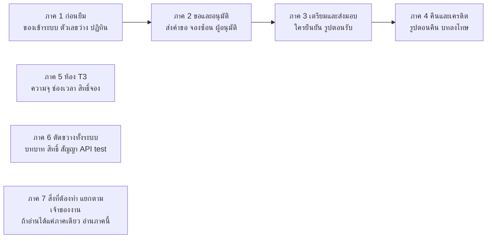

ภาค 1–4 เดินตามการยืมอุปกรณ์หนึ่งครั้งตั้งแต่ของเข้าคลังจนคืนและหักเครดิต ภาค 5 แยกห้องออกมาเพราะกฎต่างจากอุปกรณ์ทั้งชุด

### บทบาท กล่อง และป้ายคำตัดสิน

ผู้ลงมือในแต่ละขั้นมีห้าแบบ: **ผู้ยืม** **เจ้าหน้าที่** **อาจารย์** **ผู้ดูแลระบบ** และ **ระบบ** (สิ่งที่ระบบทำเองโดยไม่มีใครกด)
กรอบสีส้มแดงในภาพหน้าจอเป็นกรอบที่สคริปต์วาดทับ ชี้ส่วนที่ผลตรวจพูดถึง ไม่ได้มีอยู่ในเว็บจริง

ในฉบับ Markdown กล่องสี่สีของ PDF เขียนเป็นข้อความนำหน้า:
**ข้อสรุป** ข้อที่ต้องจำหรือทีมตัดสินแล้ว · **ต้องตัดสิน/กับดัก** แผนขัดกันเองหรือจุดที่แก้ผิดได้ ·
**ตรวจแล้วถูก** มีผลรันจริงยืนยัน · **ผิดจริง** ทำให้ผู้ใช้เห็นข้อมูลผิดหรือทำงานไม่ได้

ป้ายคำตัดสินห้าแบบ:
**[ถูก]** ข้อคิดเห็นถูกหรือระบบทำงานตรงแผน ·
**[ถูกบางส่วน]** ถูกบางส่วนหรือแผนขัดกันเองต้องตัดสิน ·
**[ต้องแก้]** ระบบผิดต้องแก้ ·
**[ทีมตัดสินแล้ว]** ·
**[ไม่ควรทำตาม]** ไม่ควรทำตามข้อคิดเห็น

### ผลตรวจหนึ่งข้ออ่านอย่างไร

ทุกข้อเดินห้าขั้นเหมือนกัน เพื่อให้แยก "สิ่งที่แผนต้องการ" ออกจาก "สิ่งที่ระบบทำ" ได้ชัด

**1 ตัวอย่าง** (สถานการณ์มีตัวเลขจริง) → **2 แผนว่าไว้** (FR / SDS / ข้อตัดสิน) → **3 ระบบทำจริง** (ภาพ ตาราง โค้ด) → **4 คำตัดสิน** → **5 ข้อเสนอ**

บรรทัดใต้หัวข้อบอกเลขข้อ ที่มา และเจ้าของงาน

---

## คำตัดสินทั้งหมดในหน้าเดียว

F01–F06 คือข้อคิดเห็นของ dev (ข้อ 5 แยกเป็นสี่ข้อย่อยตามที่เขียนมา) F07 เป็นต้นไปคือสิ่งที่ตรวจเจอเพิ่ม
เจ้าของงาน: SA, BE-lead (โครงสร้างฐานข้อมูล), BE, FE

**ข้อคิดเห็นจาก dev**

| ข้อ | เรื่อง | คำตัดสิน | เจ้าของ | หัวข้อ |
|---|---|---|---|---|
| F01 | เวลาว่างของ เปลี่ยนเป็นปฏิทินช่องกดได้/ไม่ได้ | ถูก ตัดสินแล้ว | BE FE SA | [3](#3-ผู้ยืมเลือกวันยืมจากข้อมูลอะไร) |
| F02 | backend ไม่มีความจุห้อง T3 | ถูก | BE-lead SA | [15](#15-ห้องจุได้กี่คน) |
| F03 | รายการช่องเวลาห้อง T3 ว่าง/ไม่ว่าง | ถูกบางส่วน | BE FE | [16](#16-ช่องละ-30-นาที-ต่อกันไม่เกิน-6-ช่อง--ใครบังคับกฎนี้) |
| F04 | ตัวเลข Available นับผิด อยากนับตอนอนุมัติ | ถูกบางส่วน | BE SA | [2](#2-ตัวเลข-ว่าง-3-ชิ้น-นับจากอะไร) |
| F05a | ของค้างรอตรวจสภาพ (ขีดทิ้งแล้ว) | ขีดทิ้งถูก | — | [12](#12-รายการรอตรวจสภาพ-และสถานะที่ไม่มีวันเกิด) |
| F05b | เจ้าหน้าที่รับรูปตอนคืนของ | ถูก แก้ SRS | BE FE SA | [11](#11-รูปตอนคืนของ-ใครถ่าย) |
| F05c | ผู้ยืมไม่ต้องส่งรูปตอนรับของ | ไม่ควรทำตาม | BE FE SA | [9](#9-รูปตอนรับของเป็นหลักฐานของใคร) |
| F05d | T1 ไม่มีปุ่มขอเปลี่ยนของฝั่งเจ้าหน้าที่ | ไม่ต้องมี | FE SA | [10](#10-ปุ่มขอเปลี่ยนชิ้นของ-t1-ยังต้องมีหรือไม่) |
| F06 | เจ้าหน้าที่ลงทะเบียนของ/สถานที่ และเพิ่มจำนวนชิ้น | ถูก | FE BE | [1](#1-ลงทะเบียนของหนึ่งชนิด-ต้องทำกี่ขั้น) |

**ตรวจเจอเพิ่ม**

| ข้อ | เรื่อง | คำตัดสิน | เจ้าของ | หัวข้อ |
|---|---|---|---|---|
| F07 | ปุ่มฝั่งผู้ยืม 8 จุดยังไม่ส่งข้อมูลถึง backend | ต้องแก้ | FE | 4 |
| F08 | สถานะ "กำลังจัดเตรียม" และ "รอตรวจสภาพ" ของผู้ยืมไม่มีทางเกิด | ต้องแก้ | BE FE | 12 |
| F09 | หน้าสร้างคำขอตรวจของว่างกับจำนวน "ตอนนี้" ไม่ใช่วันที่เลือก | ต้องแก้ | FE BE | 3 |
| F10 | กฎห้อง 30 นาที × 6 ช่อง บังคับแค่หน้าจอ backend รับทุกแบบ | ต้องแก้ | BE SA | 16 |
| F11 | ห้อง T3 ใครอนุมัติ SRS ไม่มีข้อ ข้อเสนอกับโค้ดตอบต่างกัน | ต้องตัดสิน | SA | 6 |
| F12 | เจ้าหน้าที่จัด serial อื่นแทน serial T2 ที่อาจารย์อนุมัติได้ | ต้องแก้ | BE | 7 |
| F13 | สร้างประเภทอุปกรณ์ไม่ตรวจหน่วยงาน · ผู้ยืมอัปโหลดรูปไม่ได้ | ต้องแก้ | BE | 19 |
| F14 | สัญญา API ฝั่ง FE ประกาศของที่ไม่มี 11 ตัว ขาดของจริง 23 ตัว | ต้องแก้ | FE | 20 |
| F15 | FE ใช้น้ำหนักเครดิตคงที่ 5/10 และเดา tier เป็น T2 | ต้องแก้ | FE | 21 |
| F16 | คีย์ข้อความ `admin.audit.searchPlaceholder` หาย โผล่เป็นคีย์ดิบ | ต้องแก้ | FE | 21 |
| F17 | มีการแบนการยืมที่ไม่มีในแผน (ยกเลิกแบนแล้วโทษความเสียหายหายด้วย) · ปฏิเสธคำขอเขียนทับเหตุผลผู้ยืม · เครดิตถูกลบตรง | ต้องแก้ | BE FE SA | 13 |
| F18 | หน้าว่างหรือข้อมูลตัวอย่าง: ส่งมอบ ส่งออก ห้อง ×3 อุทธรณ์ ×2 | ต้องแก้ | FE BE | 21 |
| F19 | อาจารย์เหลืองานจริงแค่อนุมัติ T2 | ต้องตัดสิน | SA | 18 |
| F20 | การต่ออายุ D2–D3 และ T3 ต่างจาก SRS (ค้างจากรอบก่อน) | ต้องตัดสิน | SA | ภาคผนวก ง |
| F21 | ไม่มี test ครอบวงจรยืม อนุมัติ ตรวจสภาพ | ต้องแก้ | ทีม test | 23 |
| F22 | เมนูฝั่งผู้ยืมของเจ้าหน้าที่และอาจารย์ขาด รับของ อุทธรณ์ ใช้ห้อง | ต้องแก้ | FE | 21 |
| F23 | ห้องที่ลงทะเบียนใหม่ไม่มีทางเปิดสิทธิ์จองผ่าน API | ต้องแก้ | BE | 17 |
| F24 | เพิ่มชิ้นให้ของเดิม: T0 ชนเลขซ้ำ ชิ้นใหม่ยืมไม่ได้ | ต้องแก้ | BE | 1 |
| F25 | ป้าย "ถูกระงับ" ขึ้นเมื่อมีโทษเครดิต ทั้งที่แผนไม่มีการระงับและผู้ยืมยังยืมได้ | ต้องแก้ | BE FE | 13 |
| F26 | บันทึกการใช้งานไม่มีการยืม อนุมัติ ตรวจสภาพ | ต้องแก้ | BE | 22 |

---

## ภาค 1 ก่อนยืม — ของเข้าระบบ และตัวเลข "ว่าง"

**คำถามที่ภาคนี้ตอบ: ก่อนที่ผู้ยืมคนแรกจะกดอะไร ของเข้าระบบได้ครบหรือไม่ และตัวเลขที่ผู้ยืมใช้ตัดสินใจเชื่อได้แค่ไหน**

### 1. ลงทะเบียนของหนึ่งชนิด ต้องทำกี่ขั้น

`F06 · F24` · ที่มา: dev ข้อ 6 "staff กดลงทะเบียนของ/สถานที่ เพิ่มจำนวนชิ้น" และตรวจเจอเพิ่ม · เจ้าของงาน: FE BE

**ตัวอย่าง**
ภาควิชาวิศวกรรมคอมพิวเตอร์ได้ Arduino ใหม่ 30 ชิ้น (T1) เดือนถัดมาได้เพิ่มอีก 10 ชิ้น
เจ้าหน้าที่ต้องทำให้ของทั้ง 40 ชิ้นขึ้นในรายการครุภัณฑ์ และนิสิตยืมได้

**แผนว่าไว้**
FR-EQP-01 (สูง) *"Staff ต้องสามารถลงทะเบียนประเภทอุปกรณ์ใหม่ พร้อมระบุชื่อ ราคา tier prep_days สิทธิ์การเข้าใช้"*
และ FR-EQP-03 (สูง) *"สำหรับอุปกรณ์ T1 ระบบต้องรองรับการนับเป็นจำนวน (quantity)"*
สังเกตว่า "สิทธิ์การเข้าใช้" เป็นส่วนหนึ่งของการลงทะเบียนตั้งแต่ใน SRS

**ระบบทำจริง**

#### 1.1 ทำไมหน้าจัดการอุปกรณ์ไม่มีปุ่มเพิ่มของ

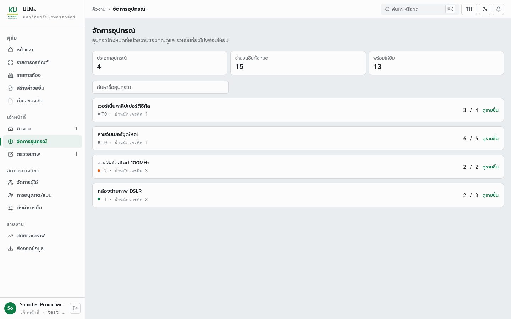

*หน้า "จัดการอุปกรณ์" ของเจ้าหน้าที่ มีแค่รายการและปุ่มดูรายชิ้น ไม่มีปุ่มลงทะเบียนประเภท เพิ่มชิ้น หรือเพิ่มห้อง
คอมเมนต์ใน `inventory-page.tsx:21-23` เขียนไว้เองว่าการลงทะเบียน "เลื่อนไปก่อน"*

ฝั่ง backend มีครบแล้ว คือ `item.createType` `item.createUnit` (รับ `quantity` 1–200) และ `item.createRoom`
แต่สัญญา API ฝั่ง FE (`trpc-contract.ts:161-167`) ยังประกาศชื่อเก่า `item.create` กับ `item.update` ซึ่งไม่มีอยู่จริง
จึงต่อหน้าจอเข้ากับของจริงตรง ๆ ไม่ได้จนกว่าจะแก้สัญญาก่อน (F14)

#### 1.2 ของที่ลงทะเบียนเสร็จแล้ว ทำไมยังไม่มีใครยืมได้

สถานการณ์ S5 และ S1 ลงทะเบียนของผ่าน API แล้วให้บัญชีผู้ยืมส่งคำขอทันที ผลคือถูกปฏิเสธทุกบรรทัด

```text
loan.create -> 200  rejected: [{ code: "NOT_ELIGIBLE",
                                 detail: { reason: "NO_RULES_CONFIGURED" } }]
```

สาเหตุอยู่ที่ `eligibility.service.ts:94` ของแต่ละชิ้นต้องมีแถวใน `Eligibility` ที่จับคู่ (หน่วยงาน, บทบาท) ไว้ก่อน
ของที่ seed ยืมได้เพราะสคริปต์ seed เขียนแถวให้เอง ของที่เจ้าหน้าที่ลงทะเบียนใหม่จึงต้องเรียกขั้นที่สาม `item.setEligibility` เสมอ

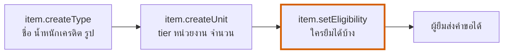

*การลงทะเบียนอุปกรณ์หนึ่งชนิดจริง ๆ คือสามคำสั่ง ขาดขั้นที่สาม = `NOT_ELIGIBLE` โดยไม่มีข้อความเตือนตอนลงทะเบียน
หน้าจอลงทะเบียนที่จะทำต้องรวมทั้งสามขั้นในฟอร์มเดียว*

#### 1.3 เพิ่มจำนวนชิ้นให้ของที่มีอยู่แล้ว ทำได้จริงหรือ

ตัวอย่าง "ได้ Arduino เพิ่มอีก 10 ชิ้น" ทดสอบใน S5 ด้วยการเรียก `createUnit` ครั้งที่สองกับประเภทเดิม ผลเสียทั้งสองแบบ

| ลำดับที่ทำ | ผล | สาเหตุ |
|---|---|---|
| T0 ลงทะเบียน 2 ชิ้น แล้วเพิ่มอีก 3 ชิ้น | 409 `SERIAL_ALREADY_IN_USE` | เลขที่ระบบสร้างให้เริ่มนับ `-1` ใหม่ทุกครั้ง ชนกับชุดแรก |
| T1 ลงทะเบียน 2 ชิ้น ตั้งสิทธิ์ แล้วเพิ่มอีก 3 ชิ้น (ใส่เลขชุดใหม่) | เพิ่มสำเร็จ แต่ยืมชิ้นใหม่ได้ `NOT_ELIGIBLE` | `setEligibility` เขียนสิทธิ์ให้เฉพาะชิ้นที่มีอยู่ตอนเรียก ชิ้นที่เพิ่มทีหลังไม่ได้ตาม |

*ผลรันจริงจาก `results/s5_registration.json`*

```ts
// backend/src/item/item.management.service.ts:898-909 (buildSerials, shortened)
const base = input.serialNo ?? `${itemName...}-${input.itemKey}`;   // same base every call
if (input.quantity === 1) return [input.serialNo ?? `${base}-1`];
return Array.from({ length: input.quantity }, (_, index) => `${base}-${index + 1}`);
```

#### 1.4 T1 ต้องติด serial ทุกชิ้นจริงหรือ

ตอนนี้ backend บังคับ ส่ง T1 โดยไม่มี serial จะได้ `400 SERIAL_REQUIRED_FOR_TIER` จากฟังก์ชัน `buildSerials`
(`item.management.service.ts` บรรทัด 881–887) คอมเมนต์ในโค้ดอ้างข้อเสนอโครงการ §5.4 ที่เขียนว่า serial ติดบน T1–T2
ซึ่งตรงกับ SRS FR-EQP-06 และ FR-PKP-01 แต่ขัดกับข้อตัดสินของทีมที่ให้ T1 ไม่ติด serial

**คำตัดสิน**
F06 **[ถูก]** ข้อคิดเห็นถูก FR-EQP-01/03/04 ระดับสูงยังไม่มีหน้าจอ ·
F24 **[ต้องแก้]** เพิ่มจำนวนชิ้นซึ่งเป็นสิ่งที่ dev ขอโดยตรง ทำไม่ได้ทั้ง T0 และ T1

**ข้อเสนอ**
- **FE** หน้า "ลงทะเบียนอุปกรณ์" ฟอร์มเดียวครบสามขั้น และปุ่ม "เพิ่มจำนวน" ในแถวของประเภทเดิม
  ต้องแก้ `trpc-contract.ts` ให้มี `createType` `createUnit` `createRoom` `setEligibility` ก่อน
- **BE** `createUnit` นับเลขต่อจากเลขสูงสุดที่มีอยู่ และคัดลอกสิทธิ์ของประเภทเดิมให้ชิ้นใหม่
  (หรือเก็บสิทธิ์ระดับประเภทแทนระดับชิ้น ซึ่งเป็นการเปลี่ยนตาราง ต้องผ่าน BE-lead)
- **BE** ตามข้อตัดสิน T1 ไม่บังคับ serial ใช้เลขที่ระบบสร้างแบบเดียวกับ T0
- **SA** แก้ FR-EQP-03 (ตัด "ผูก Serial ตอน allocation") FR-EQP-06 (เหลือ T2) FR-PKP-01 (ตัด T1) — ภาคผนวก ง

### 2. ตัวเลข "ว่าง 3 ชิ้น" นับจากอะไร

`F04` · ที่มา: dev ข้อ 4 "เลขจำนวนของที่ Available backend นับผิด ตอนนี้นับตอนเตรียมของ อยากให้นับตอนอนุมัติ" · เจ้าของงาน: BE SA

#### 2.1 สองหน้าจอ เวลาเดียวกัน ตัวเลขไม่เท่ากัน

**ตัวอย่าง**
กล้อง DSLR มี 3 ตัว นิสิตคนหนึ่งขอยืมและเจ้าหน้าที่จัดเตรียมไว้แล้ว 1 ตัว ภาพสองภาพข้างล่างถ่ายห่างกันไม่ถึงนาที (15 ก.ย. 12:58)

| ผู้ยืม หน้ารายละเอียด: **3 / 3** (กล่องขวาบน) | เจ้าหน้าที่ หน้าจัดการอุปกรณ์: **2 / 3** (แถวกล้อง DSLR) |
|---|---|
| 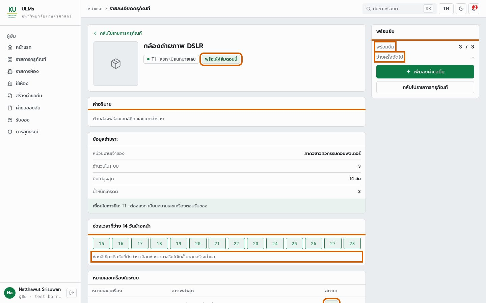 |  |

*ของชิ้นเดียวกัน เวลาเดียวกัน ผู้ยืมเห็นว่าว่างครบ เจ้าหน้าที่เห็นว่าว่าง 2*

**แผนว่าไว้**
แผนเองตอบไม่ตรงกันสามแบบ ว่าของถูก "กันไว้" เมื่อไร
- **ตอนส่งคำขอ** — SDS กรณีใช้งานส่งคำขอ ผลลัพธ์คือ *"มีแถวใน Reservations สถานะ Pending หรือ Approved และของถูกกันไว้แล้ว"*
- **ตอนอนุมัติ** — FR-APV-05 *"เมื่อคำขอได้รับการอนุมัติ ระบบต้องสร้าง Allocation"* (ตรงกับที่ dev ขอ)
- **ตอนจัดเตรียม** — ข้อเสนอโครงการ ตารางงานประจำวัน *"อุปกรณ์ถูกกันไว้ (reserved) และนัดวันรับ"*

และ FR-BRW-03 / FR-EQP-07 ต้องการ "จำนวนคงเหลือ" กับ "วันที่พร้อมให้ยืม" แบบเรียลไทม์

#### 2.2 เดินตามการยืมหนึ่งครั้ง ตัวนับแต่ละชุดขยับตอนไหน

**ระบบทำจริง**
สถานการณ์ S1 ลงทะเบียน T1 สามชิ้น แล้วเดินคำขอหนึ่งใบผ่านทุกสถานะ หลังแต่ละขั้นอ่านตัวนับทั้งสามที่ API มี

| หลังขั้นนี้ | `item.getAvailability` (ผู้ยืม รายละเอียด) | `item.list` (ผู้ยืม รายการครุภัณฑ์) | `item.listManaged` (เจ้าหน้าที่ จัดการอุปกรณ์) | ข้อเสนอ: ว่างในช่วงวันนี้ |
|---|---|---|---|---|
| 0 ลงทะเบียน 3 ชิ้น | 3 | 3 | 3 | 3 |
| 0b มีคำขอของสัปดาห์หน้า 1 ใบ | 3 | 3 | 3 | 3 |
| 1 ส่งคำขอวันนี้ (T1 อนุมัติอัตโนมัติ) | 3 | 3 | 3 | 2 |
| 2 อนุมัติแล้ว | 3 | 3 | 3 | 2 |
| 3 เจ้าหน้าที่จัดเตรียม | 3 | 3 | **2** | 2 |
| 4 ส่งมอบ | **2** | **2** | 2 | 2 |
| 5 รับคืน (ยังไม่ตรวจสภาพ) | **3** ← ของยังไม่ผ่านตรวจ แต่ขึ้นว่างแล้ว | **3** | 2 | 2 |
| 6 ตรวจสภาพแล้ว | 3 | 3 | 3 | 3 |

*ผลรันจริงจาก `results/s1_counters.json` (สามคอลัมน์แรก) สองคอลัมน์แรกให้ค่าเดียวกันเสมอเพราะใช้ฟังก์ชันเดียวกัน
คอลัมน์สุดท้ายคือข้อเสนอ: ของถูกกันตั้งแต่ส่งคำขอจนตรวจสภาพเสร็จ*

สองชุดตัวนับใช้คนละกฎ

```ts
// backend/src/common/mappers/item.mapper.ts:114  -- borrower screens
export function isUnitAvailable(unit: AvailabilityUnitRow): boolean {
  return unit.Resource.ResourceStatus === 'InStorage' && unit.Resource.AllowBorrow;
}

// backend/src/item/item.management.service.ts:997  -- staff screens
private isAvailable(unit: UnitRow): boolean {
  return unit.Resource.ResourceStatus === 'InStorage' &&
         unit.Resource.AllowBorrow &&
         unit.Resource.UsageLogs.length === 0;  // no log in Pending|Prepared|Lended|Returned
}
```

`ResourceStatus` เปลี่ยนเป็น `Lended` ตอนส่งมอบ (`loan.service.ts:432`) และกลับเป็น `InStorage` ตอนรับคืน (`loan.service.ts:515`)
ตัวนับฝั่งผู้ยืมจึงลดตอนส่งมอบและเพิ่มกลับก่อนตรวจสภาพ ส่วนฝั่งเจ้าหน้าที่ดู `UsageLog` จึงลดตั้งแต่จัดเตรียมจนตรวจเสร็จ
คำขอที่อนุมัติแล้วไม่มี `UsageLog` **จึงไม่ลดตัวนับชุดใดเลย**

#### 2.3 ทำไม dev เห็นว่า "นับตอนเตรียมของ" และทำไมยังไม่ครบ

dev ดูหน้าเจ้าหน้าที่ ซึ่งลดตอนจัดเตรียมจริง แต่ผู้ยืมไม่ได้เห็นตัวเลขนั้น ผู้ยืมเห็นตัวเลขที่ลดช้ากว่าอีกขั้น
และมีจุดผิดที่หนักกว่า คือขึ้นว่างทันทีที่รับคืน ทั้งที่ของยังไม่ผ่านตรวจสภาพและอาจเสียหาย

> **กับดัก — ย้ายจุดนับไปตอนอนุมัติ ตัวเลขก็ยังผิด**
> ตัวนับทั้งสองชุดตอบคำถาม "ตอนนี้บนชั้นมีกี่ชิ้น" แต่ผู้ยืมถามว่า "**ช่วงวันที่ฉันจะยืม** มีกี่ชิ้น"
> คำขอของสัปดาห์หน้า (แถว 0b) ไม่ควรลดตัวเลขวันนี้ แต่ต้องลดตัวเลขของสัปดาห์หน้า
> ขณะที่การกันจองจริงใน backend (`booking-window.ts:12` `HOLDING_APPROVE_STATES = ['Pending','Approved']`)
> **กันตั้งแต่คำขอยังรออนุมัติ** (พิสูจน์ในหัวข้อ 5) ถ้าตัวเลขลดตอนอนุมัติ
> ผู้ยืมคนที่สองจะเห็นว่าว่าง กดส่ง แล้วโดนปฏิเสธ `WINDOW_NOT_AVAILABLE`

#### 2.4 ควรนับที่จุดไหน

**คำตัดสิน** **[ถูกบางส่วน]** ข้อคิดเห็นถูกว่านับผิด แต่ผิดมากกว่าที่เห็น และ "นับตอนอนุมัติ" ไม่ใช่ทางแก้

**ข้อเสนอ**
- **BE** รวมเป็นฟังก์ชันเดียว *ว่างในช่วง [เริ่ม, คืน]* = ชิ้นที่ยืมได้ ลบชิ้นที่มีคำขอ `Pending/Approved` ซ้อนช่วง
  (รวม `BufferTime`) ลบชิ้นที่มี `UsageLog` ยังไม่ `Inspected` ใช้ตัวกรองเดียวกับ `clashingWindowFilter`
  ทุกหน้าจอเรียกฟังก์ชันนี้ ตัวนับ "ตอนนี้" คือช่วง [วันนี้, วันนี้]
- **SA** ตัดสินจุดกันของเป็น "ตั้งแต่ส่งคำขอ" ให้ตรงกับ backend ที่ทำงานอยู่ แล้วแก้ FR-APV-05 และข้อความในข้อเสนอให้ตรงกัน
- ฟังก์ชันนี้คือข้อมูลชุดเดียวกับที่ปฏิทินในหัวข้อถัดไปต้องใช้ ทำครั้งเดียวได้สองข้อ

### 3. ผู้ยืมเลือกวันยืมจากข้อมูลอะไร

`F01 · F09` · ที่มา: dev ข้อ 1 "เวลาว่างของ เปลี่ยนเป็นแบบปฏิทิน มีช่องกดได้กดไม่ได้" และตรวจเจอเพิ่ม · เจ้าของงาน: BE FE SA

**ตัวอย่าง**
นาย ก ต้องการกล้อง DSLR วันที่ 16–18 ก.ย. แต่วันที่ 17 ทั้ง 3 ตัวถูกจองโดยคนอื่นแล้ว
นาย ก ควรรู้ตั้งแต่ตอนเลือกวัน ไม่ใช่รู้ตอนกดส่งแล้วโดนปฏิเสธ

**แผนว่าไว้**
FR-REQ-02 บังคับวันรับและวันคืน 1–14 วัน FR-EQP-07 ให้แสดงวันที่พร้อมให้ยืม ข้อเสนอโครงการขอบเขต R01 มี
"จองล่วงหน้าแบบเลือกช่วงเวลา พร้อมปฏิทิน" และข้อตัดสินของทีมกำหนดเป็นปฏิทินแบบช่วงวันที่มีวันเทา

#### 3.1 หน้าสร้างคำขอตอนนี้ตรวจของว่างกับวันไหน

**ระบบทำจริง**

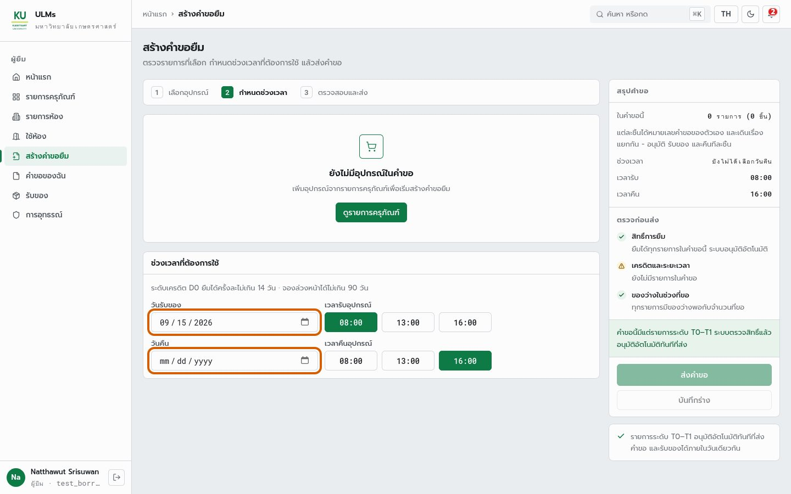

*หน้าสร้างคำขอ วันรับ/วันคืนเป็นช่องกรอกวันที่ธรรมดาสองช่อง กับปุ่มเวลา 08:00 13:00 16:00 ไม่มีข้อมูลว่าวันไหนของเต็ม*

ป้าย "ของว่างในช่วงที่ขอ" ทางขวามือไม่ได้ตรวจช่วงที่ขอจริง

```ts
// frontend/src/features/borrower/request/request-page.tsx:124
const short = rows.filter((r) => r.qty > r.item.availableUnits);  // count for "now", not the picked dates
```

#### 3.2 แถบ 14 วันสีเขียวบอกอะไรจริง

แถบ "ช่วงเวลาที่ว่าง 14 วันข้างหน้า" อยู่ในหน้ารายละเอียด (ภาพ `b-detail-t1.jpg` ในหัวข้อ 2.1 ส่วนล่าง) เขียวทั้งแถบ

แถบนี้สร้างจากตัวนับ "ตอนนี้" กับ `nextAvailableAt` เท่านั้น (`equipment-detail-page.tsx:94` `buildDays(availableUnits, nextAvailableAt)`)
เพราะ backend ไม่มีข้อมูลรายวันให้ ในแถว 0b ของตารางหัวข้อ 2.2 มีคำขอของสัปดาห์หน้าอยู่แล้ว ตัวนับยังเป็น 3
แถบจึงเขียวทุกวัน**แม้วันนั้นจะถูกจองเต็ม** ผู้ยืมอ่านแถบนี้เป็นปฏิทินและเชื่อมัน ซึ่งอันตรายกว่าไม่มีแถบเลย

#### 3.3 ปฏิทินช่วงวันที่ตกลงกัน ควรทำงานอย่างไร

**คำตัดสิน** F01 **[ถูก ตัดสินแล้ว]** · F09 **[ต้องแก้]** ข้อมูลที่หน้าจอใช้ตัดสินว่าของพอเป็นคนละช่วงเวลากับที่ผู้ยืมเลือก

**ข้อเสนอ** — ภาพปฏิทินที่เสนอ (กันยายน 2569 กล้อง DSLR ขอ 1 ตัว แถบเครดิต D0 ยืมได้ไม่เกิน 14 วัน)

| จ | อ | พ | พฤ | ศ | ส | อา |
|---|---|---|---|---|---|---|
| | ~~1~~ | ~~2~~ | ~~3~~ | ~~4~~ | ~~5~~ | ~~6~~ |
| ~~7~~ | ~~8~~ | ~~9~~ | ~~10~~ | ~~11~~ | ~~12~~ | ~~13~~ |
| ~~14~~ | 15 | 16 | ░17░ | 18 | **[19]** | **[20]** |
| **[21]** | **[22]** | **[23]** | 24 | 25 | 26 | 27 |
| 28 | 29 | 30 | | | | |

*~~ขีดฆ่า~~ = อดีต กดไม่ได้ · ░17░ = ว่าง 0 ตัว กดไม่ได้ และเลือกช่วงคร่อมวันนี้ไม่ได้ · **[ ]** = ช่วงที่เลือก 19–23 ก.ย. (5 วัน)
เลือกวันแรกแล้ว วันที่เกิน 14 วันจากวันแรกเป็นสีเทาทันที วันเทามาจากฟังก์ชัน "ว่างในช่วง" ในหัวข้อ 2 คำนวณแยกทีละวัน*

- **BE** query ใหม่ เช่น `item.availabilityCalendar({ itemKey, from, to, quantity })` คืนจำนวนว่างรายวัน
  ใช้ฟังก์ชันเดียวกับข้อ F04 ห้ามคำนวณแยกอีกชุด
- **FE** วันที่ว่างน้อยกว่าจำนวนที่ขอเป็นสีเทา ช่วงที่เลือกคร่อมวันเทาไม่ได้ ความยาวสูงสุดตามแถบเครดิต
  ตะกร้าหลายรายการ ใช้วันที่ว่างพร้อมกันทุกรายการ (ตัดกัน) ปุ่มเวลาเดิมคงไว้
- **FE** ป้าย "ของว่างในช่วงที่ขอ" ใช้ผลของช่วงที่เลือก ไม่ใช่ `availableUnits`
- **SA** เพิ่ม FR ในหมวด BRW สำหรับปฏิทินอุปกรณ์ (ตอนนี้ FR-BRW-05 มีปฏิทินแค่ของ T3)

---

## ภาค 2 ส่งคำขอและอนุมัติ

**คำถามที่ภาคนี้ตอบ: คำขอที่ผู้ยืมกดส่งไปถึงระบบจริงไหม ระบบกันการจองชนกันได้ไหม และคนที่อนุมัติคือคนที่แผนกำหนดหรือไม่**

### 4. กดส่งคำขอแล้ว คำขอไปอยู่ที่ไหน

`F07` · ที่มา: ตรวจเจอเพิ่ม (พบครั้งแรก 11 ก.ย. ยังไม่แก้) · เจ้าของงาน: FE

**ตัวอย่าง**
ผู้ยืมเลือกของ เลือกวัน กด "ส่งคำขอ" หน้าจอบอกสำเร็จและคำขอขึ้นใน "คำขอของฉัน"
เจ้าหน้าที่เปิดคิวงานไม่เห็นอะไร ผู้ยืมกดรีเฟรชหน้า คำขอหายไป

**แผนว่าไว้**
FR-REQ-01 ถึง FR-REQ-10 ทั้งหมดสมมติว่าคำขอเข้าไปอยู่ในระบบ และ backend มี `loan.create` พร้อมใช้แล้ว

**ระบบทำจริง**
ปุ่มฝั่งผู้ยืม 8 จุดเขียนผลลงที่เก็บข้อมูลในหน่วยความจำของเบราว์เซอร์ (`useSubmittedRequests`) แทนการเรียก API
ห้าจุดมี procedure รอใช้อยู่แล้ว

| ปุ่ม | ตำแหน่ง (`frontend/src/features/borrower/`) | backend มีให้เรียกแล้ว |
|---|---|---|
| ส่งคำขอ | `request/request-page.tsx:176` (TODO) | `loan.create` |
| บันทึกร่าง | `request/request-page.tsx:192` (TODO) | ไม่มี |
| ยกเลิกคำขอ | `loans/my-loans-page.tsx` ผ่าน `submitted-requests.store.ts` | `loan.cancel` (มี hook แล้วแต่ไม่ถูกเรียก) |
| ยืนยันรับของ + รูป | `pickup/pickup-page.tsx:56` (TODO) | ไม่มี (ภาค 3) |
| ขอต่ออายุ | `loans/my-loans-page.tsx:368` (TODO) | `loan.requestExtension` |
| จองห้อง | `rooms/room-booking-page.tsx:119` (TODO) | `loan.create` |
| ใช้ห้อง/ถ่ายรูปห้อง | `rooms/room-use-page.tsx:273` (TODO) | ไม่มี |
| ส่งอุทธรณ์ | `loans/submitted-requests.store.ts:197` (TODO) | ไม่มี router อุทธรณ์ |

*ปุ่มที่หน้าจอบอกว่าสำเร็จ แต่ข้อมูลไม่ถึงฐานข้อมูล ในสถานการณ์ทดสอบทุกข้อของเล่มนี้จึงต้องเรียก API ตรงแทนการกดปุ่ม*

**คำตัดสิน** **[ต้องแก้]** เป็นเหตุผลเดียวที่ใหญ่ที่สุดที่วงจรยืมยังสาธิตผ่านหน้าจอไม่ได้ ทั้งที่ backend ทำงานครบ

**ข้อเสนอ**
FE ต่อสาม procedure ที่มีครบแล้วก่อน คือ `loan.create`, `loan.cancel` และ `loan.requestExtension`
แล้วเลิกใช้ `useSubmittedRequests` ในเส้นทางของคำขอจริง ส่วนยืนยันรับของและอุทธรณ์ต้องรอ backend ตามภาค 3 และ 4

### 5. ของชิ้นเดียว สองคนขอช่วงเดียวกัน

ที่มา: ตรวจยืนยันกฎ FR-REQ-09 และเป็นหลักฐานของข้อ F04

**ตัวอย่างและผลรันจริง**
ของ T1 ชิ้นเดียว ผู้ยืมส่งคำขอ A วันที่ +3 ถึง +5 แล้วเจ้าหน้าที่ (ยืมได้ตาม FR-AUTH-04) ส่งคำขอช่วงอื่นตามมา

| คำขอ | ผล | อ่านว่า |
|---|---|---|
| A วันที่ +3 ถึง +5 | อนุมัติ (T1 อัตโนมัติ) | ของชิ้นนี้ถูกกันช่วง +3 ถึง +5 |
| B ช่วงเดียวกับ A | `WINDOW_NOT_AVAILABLE` | ซ้อนทั้งช่วง ปฏิเสธถูก |
| C วันที่ +5 ถึง +7 | `WINDOW_NOT_AVAILABLE` | ซ้อนวันสุดท้าย ปฏิเสธถูก |
| D วันที่ +6 ถึง +8 | อนุมัติ | ติดกันแต่ไม่ซ้อน ถูก |
| E วันที่ +12 ถึง +14 | อนุมัติ | ห่างกัน ถูก |

*ผลรันจริงจาก `results/s2_overlap.json`*

> **ตรวจแล้วถูก — backend กันการจองซ้อนถูกต้อง**
> การตรวจช่วงเวลาใช้ช่วงแบบครึ่งเปิด `StartTime < to AND EndTime > from` บวก `BufferTime` ทั้งสองข้าง
> (`booking-window.ts:45`) และทำใน transaction ระดับ Serializable พร้อมลองใหม่ 3 ครั้ง
> ตรงกับ FR-REQ-09 และตรงกับข้อตัดสินเรื่องปฏิทิน จุดที่ต้องแก้คือ**หน้าจอยังไม่ได้เอาข้อมูลนี้มาแสดง**ก่อนผู้ยืมกดส่ง

### 6. ใครอนุมัติคำขอระดับไหน

`F11` · ที่มา: ตรวจเจอเพิ่ม · เจ้าของงาน: SA

**แผนว่าไว้ และระบบทำจริง**

| ระดับ | SRS | โค้ด (`approval-policy.ts`) | ผลรันจริง |
|---|---|---|---|
| T0 | ระบบ อัตโนมัติ (FR-REQ-04) | ระบบ อัตโนมัติ | — |
| T1 | ระบบ อัตโนมัติ D0–D1 · อาจารย์ D2–D3 (FR-REQ-05) | ตรงกัน | D0 ได้ `approved` ทันที (S1) |
| T2 | อาจารย์ เสมอ (FR-REQ-06) | อาจารย์ | เจ้าหน้าที่กดอนุมัติได้ 403 `APPROVAL_NEEDS_SUPERVISOR` อาจารย์อนุมัติได้ (S4) |
| T3 | **ไม่มีข้อกำหนด** | เจ้าหน้าที่ | ได้ `pending` รอเจ้าหน้าที่ (S3) |

> **ต้องตัดสิน — T3 ใครอนุมัติ**
> ข้อเสนอโครงการเขียนว่า T3 "อนุมัติอัตโนมัติหลังตรวจสิทธิ์" แต่โค้ดส่งให้เจ้าหน้าที่ และหน้าจองห้อง
> บอกผู้ยืมว่า "รอเจ้าหน้าที่อนุมัติก่อนจึงจะเข้าใช้ได้" ถ้ามองตามเกณฑ์ของอาจารย์ (ทุกบทบาทมีปฏิสัมพันธ์)
> การให้เจ้าหน้าที่อนุมัติ T3 ทำให้การจองห้องมีคนสองฝ่าย จึงแนะนำให้คงตามโค้ด แล้วเพิ่ม FR ใน SRS

**คำตัดสิน** T3 **[ต้องตัดสิน]** · T0–T2 **[ตรงแผน]**

### 7. อาจารย์อนุมัติ serial A แต่เจ้าหน้าที่จัด serial B ได้หรือไม่

`F12` · ที่มา: ตรวจเจอเพิ่ม · เจ้าของงาน: BE

**ตัวอย่าง**
ออสซิลโลสโคปมีสองเครื่อง A และ B นิสิตเลือกเครื่อง A (FR-REQ-07 ให้ผู้ยืมเลือก serial ของ T2)
อาจารย์อนุมัติเครื่อง A เพราะเครื่อง B มีประวัติเสีย

**ระบบทำจริง**
สถานการณ์ S4 ให้เจ้าหน้าที่เรียก `loan.allocate` พร้อมระบุเครื่อง B

| ผู้ทำ | คำสั่ง | ผล |
|---|---|---|
| ผู้ยืม | ขอเครื่อง A | `pending` |
| อาจารย์ | อนุมัติ | สำเร็จ |
| เจ้าหน้าที่ | `allocate` ระบุเครื่อง B | **สำเร็จ** `status=Prepared serial=S4B-...` |
| เจ้าหน้าที่ | `swapUnit` สลับกลับเป็น A | 403 `UNIT_SWAP_NOT_ALLOWED` |
| เจ้าหน้าที่ | ส่งมอบเครื่อง B | สำเร็จ |

*ผลรันจริงจาก `results/s4_handover.json`*

```ts
// backend/src/loan/loan.service.ts:275  allocate -- any tier may take another unit
const target =
  input.resourceKey === undefined || input.resourceKey === reservation.Resource.ResourceKey
    ? reservation.Resource
    : await this.resolveSwapTarget(user, reservation.Resource, input.resourceKey);

// backend/src/loan/loan.service.ts:351  swapUnit -- the same move, but refused unless T1
throw new BusinessError('UNIT_SWAP_NOT_ALLOWED', { ... });
```

> **ผิดจริง — สองประตูทำเรื่องเดียวกันแต่ล็อกแค่ประตูเดียว**
> `swapUnit` ห้ามเปลี่ยนเครื่องของ T2 แต่ `allocate` ทำสิ่งเดียวกันได้โดยไม่ตรวจระดับ
> ผลคือเครื่องที่ออกจากเคาน์เตอร์ไม่ใช่เครื่องที่อาจารย์อนุมัติ และอาจารย์ไม่มีทางรู้

**คำตัดสิน** **[ต้องแก้]**

**ข้อเสนอ**
BE ให้ `allocate` ปฏิเสธ `resourceKey` ที่ต่างจากที่อนุมัติเมื่อเป็น T2 ด้วยการตรวจเดียวกับ `swapUnit`
เมื่อ T1 ไม่มี serial และเปลี่ยนชิ้นนอกระบบแล้ว (ข้อตัดสิน) `swapUnit` จะไม่มีผู้ใช้ ทีม BE เลือกได้ว่าจะเก็บหรือลบ

---

## ภาค 3 เตรียมของและส่งมอบ

**คำถามที่ภาคนี้ตอบ: ตอนของออกจากเคาน์เตอร์ ใครเป็นคนยืนยัน และหลักฐานสภาพของตอนนั้นเป็นของใคร**

### 8. ใครเป็นคนยืนยันว่าของออกจากเคาน์เตอร์แล้ว

`F05c (ส่วนแรก)` · ที่มา: dev ข้อ 5 "ตอนนี้ staff กดส่งมอบแล้ว ผู้ยืมไม่ต้องส่งรูปตอนรับของ" · เจ้าของงาน: BE FE SA

**ตัวอย่าง**
เจ้าหน้าที่จัดเตรียมกล้อง DSLR ไว้แล้ว นิสิตมาที่เคาน์เตอร์ ในระบบตอนนี้มีปุ่ม "ยืนยัน" สองปุ่มสำหรับเหตุการณ์เดียวกัน

| เจ้าหน้าที่ คิวงาน "รอส่งมอบ 1" ปุ่มส่งมอบเรียก `loan.confirmPickup` จริง | ผู้ยืม หน้ารับของ บังคับถ่ายรูปก่อนกด "ยืนยันรับของ" แต่ไม่ส่งอะไรออกไป |
|---|---|
| 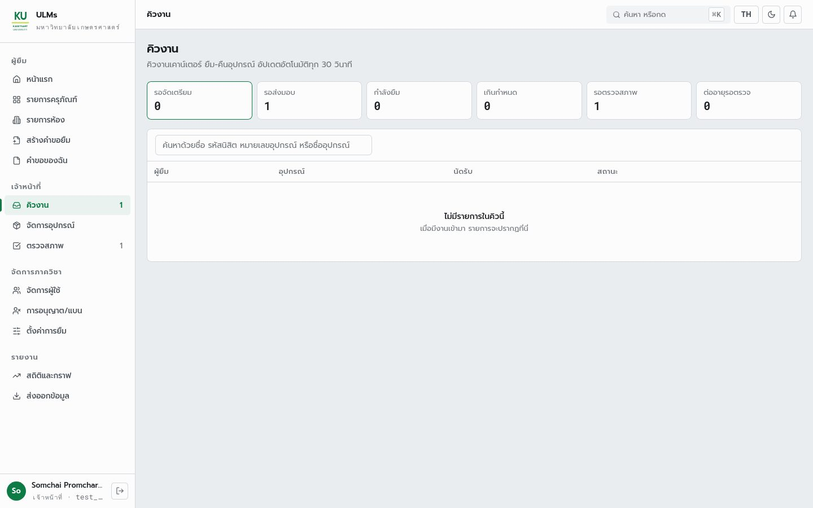 | 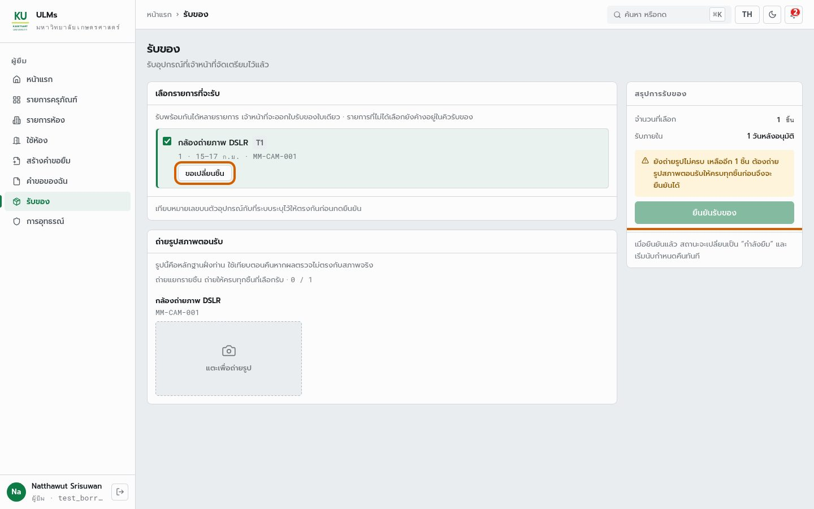 |

*สองหน้าจอ ถ่ายจากระบบเดียวกันเวลาเดียวกัน ของชิ้นเดียวกัน*

**แผนว่าไว้**
- FR-PKP-02 (สูง) *"Borrower ต้องยืนยันการรับอุปกรณ์และตรวจสอบ Serial Number ก่อนกดยืนยัน"*
- FR-PKP-03 (สูง) *"ระบบต้องบังคับให้ Borrower อัปโหลดรูปถ่ายอุปกรณ์ตอนรับก่อนกดยืนยัน"*
- SDS ตารางสถานะ: `Prepared` → `Lended` ผู้ทำคือผู้ยืม
- BPMN กระบวนการยืม: ผู้ยืม "ถ่ายรูปอุปกรณ์ตอนรับ + อัปโหลดเข้าระบบ" (`bpmn_data.py:49`) แล้วระบบจึงตั้งสถานะกำลังใช้งาน

**ระบบทำจริง**

| ผู้ทำ | คำสั่ง (S4) | ผล |
|---|---|---|
| ผู้ยืม | `loan.confirmPickup` | 403 `ROLE_NOT_ALLOWED` — ผู้ยืมไม่มีคำสั่งยืนยันรับของเลย |
| ผู้ยืม | `image.requestUpload` (ขอที่อัปโหลดรูป) | 403 `ROLE_NOT_ALLOWED` — อัปโหลดได้เฉพาะเจ้าหน้าที่ (`image.router.ts:22`) |
| เจ้าหน้าที่ | `loan.confirmPickup` | สำเร็จ `status=Lended` ไม่มีช่องรับรูป |

คอมเมนต์ของ `confirmPickupInput` (`loan.schema.ts:201`) ยังเขียนตามแผนเดิม
*"No image is uploaded here. Photos ... are attached by the borrower's own confirmation step"*
แต่ขั้นยืนยันของผู้ยืมที่อ้างถึงไม่มีอยู่ ผลคือตาราง `Images` ในฐานข้อมูลทดสอบมี **0 แถว** หลังการยืมครบวงจรไปแล้ว 3 ครั้ง

### 9. รูปตอนรับของเป็นหลักฐานของใคร

`F05c (คำตัดสิน)` · ที่มา: dev ข้อ 5 · เจ้าของงาน: BE FE SA

ข้อคิดเห็นของ dev แก้ปัญหา "ยืนยันซ้ำสองที่" ด้วยการตัดฝั่งผู้ยืมทิ้ง ซึ่งง่ายที่สุดในเชิงโค้ด แต่ตัดสิ่งที่แผนตั้งใจไว้ออกไปด้วย

> **ต้องตัดสิน — ถ้าตัดรูปตอนรับทิ้ง อะไรพังต่อ**
> - FR-RTN-02 ให้เจ้าหน้าที่ **เปรียบเทียบรูปตอนรับกับตอนคืน** ถ้าไม่มีรูปตอนรับ ไม่มีอะไรให้เทียบ
> - FR-APL-03 ให้อาจารย์เห็นรูปก่อน–หลังตอนตัดสินอุทธรณ์ รูปตอนรับคือ**หลักฐานเดียวของผู้ยืม**ว่ารอยนั้นมีมาก่อน
>   หน้าอุทธรณ์ฝั่งอาจารย์ (แม้ยังเป็นข้อมูลตัวอย่าง) ก็ออกแบบช่อง "ตอนรับของ" ไว้แล้ว
> - เกณฑ์ของอาจารย์: ถ้าเจ้าหน้าที่ยืนยันเองและถ่ายรูปเองทุกจุด ผู้ยืมไม่มีบทบาทในการส่งมอบเลย

**ตามโค้ดตอนนี้**

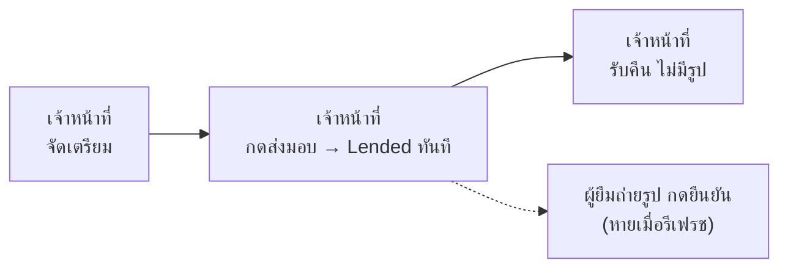

**ข้อเสนอ (ตรงกับ BPMN)**

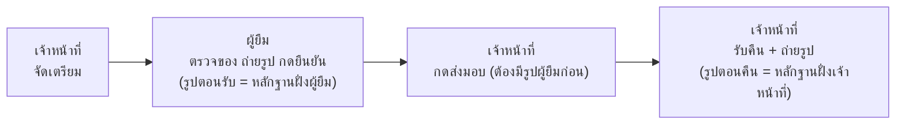

*ข้อเสนอให้รูปสองจุดมาจากสองฝ่ายที่เป็นอิสระต่อกัน เจ้าหน้าที่ยังเป็นคนกดส่งมอบตามที่ dev ต้องการ แต่กดได้หลังผู้ยืมยืนยันแล้วเท่านั้น*

**คำตัดสิน** **[ไม่ควรทำตาม]** ปัญหาที่ dev ชี้ (ยืนยันซ้ำ) มีจริง แต่ทางแก้ต้องไม่ใช่การตัดรูปตอนรับ

**ข้อเสนอ**
- **BE** เพิ่มคำสั่งฝั่งผู้ยืม เช่น `loan.confirmReceipt({ usageKey, imageUrls })` บันทึกลงตาราง `Images`
  เป็น `BeforePicture` (ชนิดนี้มีอยู่แล้วใน enum `SubmissionType` ไม่ต้องเพิ่มตาราง)
- **BE** `confirmPickup` ของเจ้าหน้าที่ปฏิเสธถ้ายังไม่มี `BeforePicture` ของการยืมนั้น ไม่ต้องเพิ่มสถานะใหม่
- **BE** `image.requestUpload` ลดเป็นผู้ใช้ที่ล็อกอิน แล้วตรวจตามจุดประสงค์ ผู้ยืมอัปโหลดได้เฉพาะของการยืมของตัวเอง
  (คอมเมนต์ใน `image.router.ts` วางแผนเรื่องนี้ไว้แล้ว)
- **FE** หน้ารับของต่อคำสั่งใหม่ คิวงานเจ้าหน้าที่แสดงว่า "รอผู้ยืมยืนยัน" หรือ "ยืนยันแล้ว"
- **SA** คง FR-PKP-02/03 เพิ่มขั้น "เจ้าหน้าที่กดส่งมอบหลังผู้ยืมยืนยัน" ลงใน FR-PKP และตารางสถานะของ SDS

### 10. ปุ่มขอเปลี่ยนชิ้นของ T1 ยังต้องมีหรือไม่

`F05d` · ที่มา: dev ข้อ 5 "ของ T1 ไม่มีกดขอเปลี่ยนของ (staff)" · เจ้าของงาน: FE SA

**แผนว่าไว้**
FR-PKP-04 (กลาง) *"สำหรับ T1 Borrower ต้องสามารถขอเปลี่ยนอุปกรณ์ตอนรับได้หากพบปัญหา"*
และข้อตัดสินของทีม: T1 ไม่มี serial การเปลี่ยนชิ้นทำกับเจ้าหน้าที่ตรงหน้าเคาน์เตอร์ ไม่บันทึก

**ระบบทำจริง**
ปุ่ม "ขอเปลี่ยนชิ้น" มีอยู่ในหน้ารับของของผู้ยืม (ภาพ `b-pickup.jpg` ในหัวข้อ 8 กรอบส้มแดง;
`pickup-page.tsx:197` `canSwap = row.tier === "T1"`) ทำงานแค่ในหน้าจอ
ส่วน backend มี `loan.swapUnit` สำหรับเจ้าหน้าที่ แต่ไม่มีหน้าจอใดเรียก

> **ข้อสรุป — ข้อตัดสินทำให้คำถามนี้หายไปเอง**
> เมื่อ T1 ไม่มี serial ชิ้นทุกชิ้นของประเภทเดียวกันแทนกันได้ในสายตาระบบ เปลี่ยนตัวที่เคาน์เตอร์แล้ว
> ข้อมูลในระบบยังถูกต้องทุกช่อง (ประเภท จำนวน ผู้ยืม วันคืน) จึงไม่มีอะไรต้องบันทึก
> และไม่ต้องมีปุ่มทั้งฝั่งผู้ยืมและฝั่งเจ้าหน้าที่

**คำตัดสิน** **[ไม่ต้องมีปุ่ม]**

**ข้อเสนอ**
FE ลบปุ่มขอเปลี่ยนชิ้นในหน้ารับของ · BE ตัดสินว่าจะเก็บ `loan.swapUnit` ไว้หรือลบ · SA ตัด FR-PKP-04 หรือเขียนใหม่ว่าเปลี่ยนนอกระบบ

---

## ภาค 4 คืน ตรวจสภาพ และเครดิต

**คำถามที่ภาคนี้ตอบ: ตอนของกลับมา ระบบมีหลักฐานพอให้ตัดสินความเสียหายหรือไม่ และบทลงโทษที่ออกมาทำงานตามกฎเครดิตหรือเปล่า**

### 11. รูปตอนคืนของ ใครถ่าย

`F05b` · ที่มา: dev ข้อ 5 "รับรูปตอนคืนของ (staff)" · เจ้าของงาน: BE FE SA

**ตัวอย่าง**
นิสิตคืนคาลิปเปอร์ เจ้าหน้าที่เปิดหน้าตรวจสภาพเพื่อเทียบรูปก่อนและหลัง แล้วให้ระดับความเสียหาย

**แผนว่าไว้ — สองเอกสารพูดต่างกัน**
- SRS FR-RTN-01 (สูง) *"Borrower ต้องสามารถแจ้งคืนผ่านระบบพร้อมอัปโหลดรูปถ่ายตอนคืน"* — ผู้ยืมถ่าย
- BPMN กระบวนการคืน เลนเจ้าหน้าที่ *"ถ่ายรูปอุปกรณ์ตอนคืน + อัปโหลดเข้าระบบ"* (`bpmn_data.py:153`) — เจ้าหน้าที่ถ่าย

**ระบบทำจริง**

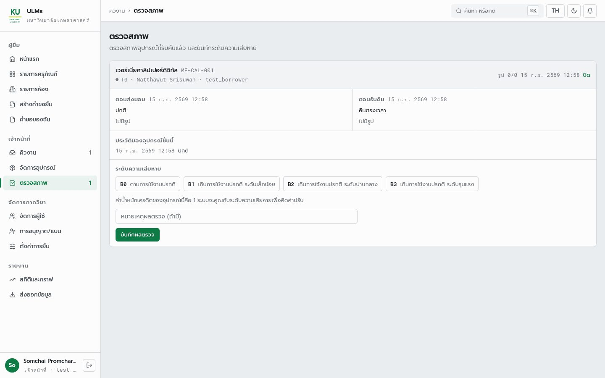

*หน้าตรวจสภาพ ของที่รับคืนแล้ว "ตอนส่งมอบ ไม่มีรูป" "ตอนรับคืน ไม่มีรูป" มุมขวาบน "รูป 0/0" และฟอร์มให้ระดับความเสียหายไม่มีช่องแนบรูป*

ไม่มีจุดใดในระบบเขียนรูปตอนคืน `recordReturnInput` (`loan.schema.ts:222`) รับแค่ `usageKey` กับ `note`
ส่วน `inspection.create` รับ `imageUrls` ได้ แต่หน้าตรวจสภาพส่งแค่ `usageKey level note` (`inspection-page.tsx:175-179`)

**คำตัดสิน** **[ถูก แก้ SRS]** ข้อคิดเห็นตรงกับ BPMN และสมเหตุสมผลกว่า SRS เพราะของคืนที่เคาน์เตอร์ต่อหน้าเจ้าหน้าที่
รวมกับข้อเสนอในหัวข้อ 9 ทำให้รูปสองจุดมาจากสองฝ่าย

**ข้อเสนอ**
- **BE** `recordReturn` รับ `imageUrls` บันทึกเป็น `AfterPicture` (ใช้ตาราง `Images` เดิม)
- **FE** ปุ่มรับคืนในคิวงานเปิดกล้องก่อนยืนยัน หน้าตรวจสภาพแสดงรูปผู้ยืม (ก่อน) คู่รูปเจ้าหน้าที่ (หลัง) ตาม FR-RTN-02
- **SA** แก้ FR-RTN-01 เป็นเจ้าหน้าที่ถ่ายรูปตอนรับคืน ผู้ยืมไม่ต้องแจ้งคืนผ่านระบบ

### 12. รายการรอตรวจสภาพ และสถานะที่ไม่มีวันเกิด

`F05a · F08` · ที่มา: dev ข้อ 5 (ขีดทิ้ง) และตรวจเจอเพิ่ม · เจ้าของงาน: BE FE

dev ขีดข้อ "ของค้างที่รอตรวจสภาพ (staff)" ทิ้งเอง ซึ่งถูก รายการนี้มีแล้วทั้งในคิวงาน (ช่อง "รอตรวจสภาพ 1" ในภาพหัวข้อ 8)
และหน้าตรวจสภาพ (ภาพหัวข้อ 11) ดึงจาก `inspection.list` จริง **[ขีดทิ้งถูก]**

แต่ฝั่งผู้ยืมมีสองสถานะที่ไม่มีทางแสดง

| สถานะ | มาจาก | ทำไมไม่เกิด |
|---|---|---|
| `preparing` "กำลังจัดเตรียม" | `loan.request.service.ts:585` แปลงจาก `UsageLog.CurrentStatus = Pending` | ไม่มีโค้ดใดเขียน `Pending` `allocate` สร้าง `Prepared` ทันที |
| `inspecting` "รอตรวจสภาพ" | `mock-data.ts:484` ฝั่ง FE | backend ไม่มีสถานะนี้ ส่ง `returned` มาแทน |

**คำตัดสิน** F08 **[ต้องแก้ ระดับต่ำ]** ผู้ยืมไม่เห็นว่าของกำลังถูกตรวจ

**ข้อเสนอ** BE ตัด `preparing` ออกจากชุดสถานะ หรือให้มีขั้นจริง · FE แสดง `returned` เป็น "รอตรวจสภาพ" แล้วลบ `inspecting`

### 13. บทลงโทษทำงานตรงกับกฎเครดิตหรือไม่

`F17 · F25` · ที่มา: ตรวจเจอเพิ่ม (สองข้อแรกพบ 11 ก.ย. ยังไม่แก้) · เจ้าของงาน: BE FE

**ตัวอย่าง**
นิสิตคืนออสซิลโลสโคประดับ B2 ได้โทษหักเครดิต ต่อมาเจ้าหน้าที่เปิดเมนู "การอนุญาต/แบน" แบนนิสิตคนนี้ 7 วัน
นิสิตส่งคำขอยืมไม่ได้ สามวันต่อมาเจ้าหน้าที่ยกเลิกแบน

**แผนว่าไว้**
**แผนไม่มีการแบนการยืม** บทลงโทษมีผลผ่านแถบเครดิตเท่านั้น คือจำกัดจำนวนวันยืมและเปลี่ยนเส้นทางการอนุมัติ
FR-CRD-04 อายุโทษ = discredit × 2 วัน · FR-CRD-06 *"credit_score ต้องคำนวณจากผลรวมของ Demerit Event ที่ยัง active เท่านั้น ไม่แก้ไขโดยตรง"*
· FR-CRD-08 สิทธิ์การยืมปรับตามแถบเครดิต D0–D3
ส่วน FR-ADM-03 *"Admin ต้องสามารถระงับบัญชีผู้ใช้และคืนบัญชีได้"* คือปิดบัญชีทั้งบัญชี ซึ่งโค้ดทำด้วย `setUserActive` แยกต่างหาก

**ระบบทำจริง (ยืนยันจากโค้ด ยังไม่ได้รันสถานการณ์นี้)**
โค้ดมี**การแบนการยืม**ที่ไม่มีใน SRS: `admin.setUserBan` (`admin.router.ts:154` เจ้าหน้าที่ใช้ได้)
หน้า "การอนุญาต/แบน" ของเจ้าหน้าที่และอาจารย์ และ `loan.create` ปฏิเสธด้วย `BORROWING_SUSPENDED`
(`loan.request.service.ts:142`) e2e test TP-ADM-E2E-05/06 ทดสอบการแบนนี้อยู่ และ SDS v1.1 เขียนการระงับการยืมตามโค้ดไว้
(`sds_data.py:144` และ `:525`) ฟีเจอร์นี้ยังเพิ่มอำนาจให้เจ้าหน้าที่ ซึ่งสวนเกณฑ์สมดุลบทบาท (หัวข้อ 18)

ตาราง `PenaltyInfo` เก็บการแบนกับโทษเครดิตในแถวแบบเดียวกัน แต่ตัวกรองสามจุดแยกชนิดไม่เหมือนกัน

| ชนิดโทษ | กันการยืม (`activeBanWhere`) | ป้าย "ถูกระงับ" (`admin.schema.ts:18`) | ยกเลิกแบน (`admin.service.ts:450`) | ตรงแผนไหม |
|---|---|---|---|---|
| แบน โดยเจ้าหน้าที่/ผู้ดูแล (ไม่มี `UsageKey`) | กัน | ขึ้น | ปิดโทษ | **ไม่มีในแผน** |
| โทษความเสียหาย/คืนช้า (`penalty.service.ts:179`) | ไม่กัน (ตาม FR-CRD-08 ถูก) | **ขึ้น** | **ปิดโทษด้วย** | **ผิด 2 จุด** |

```ts
// backend/src/admin/admin.service.ts:450  setUserBan({ banned: false })
await this.prisma.penaltyInfo.updateMany({
  where: { AccountKey: input.id, ...activePenaltyWhere() },   // every active penalty, damage included
  data: { InEffect: false },
});
// backend/src/common/schemas/penalty.schema.ts:72
export function activeBanWhere() {
  return { ...activePenaltyWhere(), UsageKey: null, CreditDeducted: null };  // bans only
}
```

อีกสองจุดในหมวดเดียวกัน
- เครดิตถูกลบตรงที่ `AccountInfo.UserCredit` (`penalty.service.ts:198` `decrement`) ไม่ได้คำนวณจากโทษที่ยัง active
  ตาม FR-CRD-06 ผลคือโทษที่ถูกปิด (ด้วยการยกแบนหรือการอุทธรณ์) ไม่คืนเครดิตให้เอง
- ปฏิเสธคำขอแล้วเหตุผลของผู้ยืมถูกเขียนทับด้วยเหตุผลที่ปฏิเสธ (`approval.service.ts:253` `Reason: input.reason ?? row.Reason`)

**คำตัดสิน** F17 **[ต้องแก้]** · F25 **[ต้องแก้ ระดับต่ำ]** เจ้าหน้าที่เห็นว่านิสิต "ถูกระงับ" ทั้งที่นิสิตยังยืมได้

**ข้อเสนอ**
- **BE/FE** ลบการแบนการยืมที่ไม่มีในแผน (`setUserBan` `assertNotBanned` หน้า "การอนุญาต/แบน" และ e2e ที่เกี่ยวข้อง)
  ถ้าทีมตัดสินคงไว้ ต้องเพิ่มเข้า SRS และยกเลิกแบนต้องใช้ `activeBanWhere()` แทน `activePenaltyWhere()`
- **BE/FE** ป้ายสถานะผู้ใช้แสดงแถบเครดิตและโทษที่ยังมีผล แทน "ถูกระงับ"
- **SA** แก้ SDS v1.1 ส่วนที่เขียนการระงับการยืมไว้ตามโค้ด
- **BE** เก็บเหตุผลที่ปฏิเสธแยกจากเหตุผลของผู้ยืม ถ้าต้องเพิ่มคอลัมน์ต้องผ่าน BE-lead ระหว่างนี้ส่งในการแจ้งเตือนได้
- **SA** ตัดสินว่า FR-CRD-06 (คำนวณจากโทษที่ active) ยังต้องการหรือไม่ ถ้าต้องการ การปิดโทษต้องคำนวณเครดิตใหม่

### 14. อุทธรณ์ทำได้แค่ไหน

`F18 (อุทธรณ์)` · ที่มา: ตรวจเจอเพิ่ม · เจ้าของงาน: BE FE

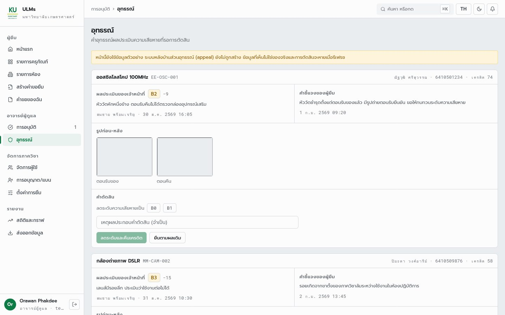

*หน้าอุทธรณ์ของอาจารย์ แถบเหลืองด้านบนบอกเองว่า "หน้านี้ยังใช้ข้อมูลตัวอย่าง ระบบหลังบ้านส่วนอุทธรณ์ยังไม่ถูกสร้าง"*

backend ไม่มี router อุทธรณ์ แม้ตาราง `AppealInfo` จะมีแล้ว หน้าส่งอุทธรณ์ของผู้ยืมก็เก็บในหน่วยความจำ (F07)
FR-APL-01 ถึง FR-APL-06 จึงยังไม่มีข้อใดทำงาน ข้อนี้กระทบเกณฑ์ของอาจารย์โดยตรง เพราะอุทธรณ์คืองานหลักอย่างหนึ่งของบทบาทอาจารย์ (หัวข้อ 18)

**คำตัดสิน** **[ต้องแก้]**

**ข้อเสนอ**
BE สร้าง router อุทธรณ์ (`create list getById decide` ตามชื่อที่ FE ประกาศไว้แล้ว) ผู้ตัดสินต้องไม่ใช่ผู้ประเมินเดิม (FR-APL-04)
ผ่านแล้วปิดโทษและคืนเครดิต (FR-APL-05) · FE ต่อสองหน้าที่มีอยู่

---

## ภาค 5 ห้อง T3

**คำถามที่ภาคนี้ตอบ: กฎของห้องที่ทีมตกลงแล้ว มีข้อมูลรองรับและถูกบังคับจริงหรือไม่**

### 15. ห้องจุได้กี่คน

`F02` · ที่มา: dev ข้อ 2 "backend ไม่มีความจุห้อง T3" · เจ้าของงาน: BE-lead SA

**แผนว่าไว้**
FR-EQP-04 (สูง) *"Staff ต้องสามารถลงทะเบียนสถานที่ (T3) พร้อมกำหนดจำนวนที่นั่ง ความยาวสล็อต และช่วงเวลาเปิดใช้"*

**ระบบทำจริง**

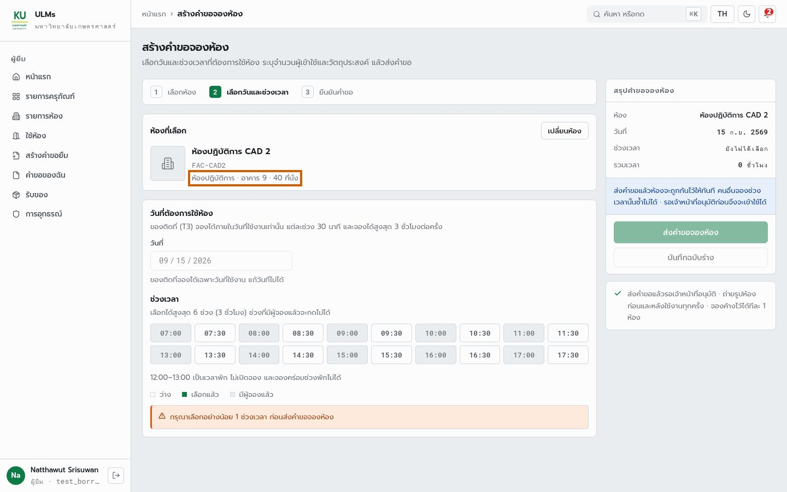

*หน้าจองห้องแสดง "40 ที่นั่ง" และช่องเวลา 30 นาที 07:00–17:30 ครบตามข้อตัดสิน แต่ข้อมูลทั้งหน้ามาจาก `mock-data.ts` ไม่ใช่ฐานข้อมูล*

ห้องที่สร้างผ่าน `item.createRoom` ใน S3 ได้กลับมาแค่ช่องเหล่านี้ ไม่มีความจุ ความยาวช่อง หรือเวลาเปิด

```text
item.createRoom -> { condition, creditWeight, description, imageUrl, lendable, location,
                     managementGroup, name, resourceKey, roomKey, status, tier }
```

ตาราง `RoomInfo` (`schema.prisma:281`) มีแค่ชื่อ คำอธิบาย ที่ตั้ง รูป และน้ำหนักเครดิต ทั้ง ER และ SDS ก็ไม่มีช่องนี้

> **ต้องตัดสินก่อนเพิ่มคอลัมน์ — ความจุใช้ทำอะไร**
> หน้าจอและ backend ตอนนี้จองห้องแบบ**ทั้งห้อง** (ช่องที่มีคนจองแล้วกดไม่ได้ S3 ข้อ R7 ชนถูกปฏิเสธ)
> ส่วนข้อเสนอโครงการยกตัวอย่าง "ห้อง 7603 จะมีที่ว่าง 2 ที่ ในเวลา 14:00" ซึ่งเป็นการจอง**รายที่นั่ง**
> ถ้าจองทั้งห้อง ความจุเป็นข้อมูลให้เลือกห้องและตรวจ "จำนวนผู้เข้าใช้ ≤ ความจุ" ถ้าจองรายที่นั่ง
> กฎกันซ้อนทั้งหมดต้องเปลี่ยน แนะนำแบบทั้งห้องตามที่ทำอยู่

**คำตัดสิน** **[ถูก]**

**ข้อเสนอ**
**BE-lead** เพิ่ม `RoomInfo.Capacity` (และเวลาเปิด–ปิด ถ้าไม่ใช้ค่ากลางทั้งระบบ) ไม่ต้องเพิ่มความยาวช่อง เพราะทีมตัดสินเป็น 30 นาทีทุกห้อง
· **SA** แก้ FR-EQP-04 ให้ความยาวช่องเป็นค่ากลาง และระบุว่าจองทั้งห้อง

### 16. ช่องละ 30 นาที ต่อกันไม่เกิน 6 ช่อง — ใครบังคับกฎนี้

`F03 · F10` · ที่มา: dev ข้อ 3 "List slot เวลายืมห้อง T3 เก็บว่าง/ไม่ว่าง" และตรวจเจอเพิ่ม · เจ้าของงาน: BE FE SA

**แผนว่าไว้ — สามชั้นพูดคนละเลข**

| ที่ | กฎ |
|---|---|
| ข้อตัดสินของทีม | ช่องละ 30 นาที ต่อกันไม่เกิน 6 ช่อง |
| SRS FR-REQ-08 | **รายชั่วโมง จองพร้อมกันสูงสุด 2 สล็อต** · FR-RSV-02 จองได้เฉพาะวันเดียวกัน |
| หน้าจองห้อง (FE) | 30 นาที สูงสุด 6 ช่อง ต่อเนื่อง วันเดียวกัน 07:00–18:00 เว้น 12:00–13:00 — ตรงข้อตัดสิน |
| ค่าคงที่ FE | `MAX_T3_CONCURRENT_SLOTS: 2` ยังค้าง และ `test:ac` ข้อ 2.6 ยังทดสอบว่า "จองช่องที่ 3 ไม่ได้" |
| backend | **ไม่มีกฎใดเลย** นอกจากกันซ้อน |

**ระบบทำจริง**
S3 ส่งคำขอจองห้องตรงเข้า API (เหมือนหน้าจออื่นหรือสคริปต์ที่ข้ามหน้าจองห้อง) แล้วเทียบกับกฎ

| คำขอ | ผิดกฎข้อไหน | backend ตอบ |
|---|---|---|
| R1 พรุ่งนี้ 09:00–09:30 | วันเดียวกัน | **รับ** `pending` |
| R2 พรุ่งนี้ 09:15–09:45 | นอกกริด · ซ้อน R1 | ปฏิเสธ `WINDOW_NOT_AVAILABLE` (เพราะซ้อน) |
| R3 พรุ่งนี้ 13:10–13:40 | นอกกริด | **รับ** |
| R4 พรุ่งนี้ 14:00–17:30 (7 ช่อง) | เกิน 6 ช่อง | **รับ** |
| R4b อีก 2 วัน 09:00–12:00 (6 ช่อง) | วันเดียวกัน | **รับ** |
| R5 พรุ่งนี้ 22:00 ถึงตี 1 | นอกเวลาเปิด · ข้ามวัน | **รับ** |
| R6 อีก 5 วัน 09:00–10:00 | วันเดียวกัน | **รับ** |
| R7 คนอื่นขอ 09:00–09:30 ซ้ำ R1 | ซ้อน | ปฏิเสธ `WINDOW_NOT_AVAILABLE` |

*ผลรันจริงจาก `results/s3_rooms.json` ปฏิเสธ 2 ใน 8 และทั้งสองครั้งเพราะช่วงซ้อนเท่านั้น*

ส่วนช่อง "ว่าง/ไม่ว่าง" ที่หน้าจอแสดง มาจากค่าสมมติ (`mock-data.ts:352` TODO `GET /facilities/:id/slots`)

> **กับดัก — "เก็บว่าง/ไม่ว่าง" ไม่ควรเป็นตารางใหม่**
> ความว่างของช่องคำนวณได้จาก `Reservations` ที่มีอยู่ (มี index `ResourceKey, StartTime, EndTime` แล้ว)
> ถ้าเก็บเป็นตาราง slot แยก จะมีความจริงสองชุดที่ต้องทำให้ตรงกันทุกครั้งที่จอง ยกเลิก หรือหมดอายุ
> ซึ่งเป็นปัญหาแบบเดียวกับตัวนับในหัวข้อ 2 และการเพิ่มตารางต้องผ่าน BE-lead ด้วย

**คำตัดสิน** F03 **[ถูกบางส่วน]** ต้องมี API รายการช่องจริง แต่ไม่ต้องเก็บ · F10 **[ต้องแก้]**

**ข้อเสนอ**
- **BE** `loan.create` สำหรับห้อง ตรวจ: นาทีหาร 30 ลงตัว · ยาว ≤ 180 นาที · วันเดียวกันตามเวลาไทย · อยู่ในเวลาเปิดไม่คร่อมพักเที่ยง · วันเริ่มคือวันนี้
- **BE** query `item.roomSlots({ resourceKey, date })` คืน 20 ช่องพร้อมสถานะ คำนวณจาก `Reservations`
- **FE** หน้าจองห้องใช้ query นี้แทนค่าสมมติ ลบ `MAX_T3_CONCURRENT_SLOTS` และแก้ `test:ac` ข้อ 2.6
- **SA** แก้ FR-REQ-08 เป็น "ช่องละ 30 นาที ต่อเนื่องไม่เกิน 6 ช่องต่อการจอง"

### 17. ห้องที่ลงทะเบียนใหม่ จองได้หรือไม่

`F23` · ที่มา: ตรวจเจอเพิ่ม · เจ้าของงาน: BE

**ระบบทำจริง**
S3 สร้างห้องด้วย `item.createRoom` แล้วให้ผู้ยืมจองทันที ได้ `NOT_ELIGIBLE / NO_RULES_CONFIGURED`
แบบเดียวกับอุปกรณ์ในหัวข้อ 1 แต่ต่างกันตรงที่ห้อง**ไม่มีคำสั่งให้เปิดสิทธิ์**
เพราะ `item.setEligibility` รับ `itemKey` ของประเภทอุปกรณ์เท่านั้น และห้องไม่มี `itemKey`

> **ผิดจริง — ห้องที่เจ้าหน้าที่เพิ่มเอง ไม่มีใครจองได้ตลอดไป**
> การทดสอบกฎช่องเวลาใน S3 ต้องเขียนแถว `Eligibility` ลงฐานข้อมูลตรง (บันทึกไว้ในผลรันเป็น "DB workaround")
> เพราะไม่มีทางอื่น ในระบบจริงห้องทุกห้องที่ไม่ได้มาจาก seed จะจองไม่ได้

**คำตัดสิน** **[ต้องแก้]**

**ข้อเสนอ** BE ให้ `createRoom` รับชุดสิทธิ์ หรือเพิ่ม `item.setRoomEligibility({ resourceKey, rules })`

---

## ภาค 6 ตรวจตัดขวางทั้งระบบ

**คำถามที่ภาคนี้ตอบ: เมื่อมองข้ามหน้าจอทีละหน้า ระบบทั้งชุดยังสอดคล้องกันเองหรือไม่**

### 18. ทุกบทบาทมีงานที่ขาดไม่ได้จริงหรือไม่

`F19` · ที่มา: เกณฑ์ของอาจารย์ · เจ้าของงาน: SA

**แผนว่าไว้**
อาจารย์กำหนดว่าทุกบทบาทต้องมีปฏิสัมพันธ์กัน ไม่มีบทบาทใดทำทุกอย่าง และไม่มีบทบาทใดแทบไม่มีงาน
ตารางนี้นับเฉพาะขั้นที่**ทำผ่านหน้าจอได้จริงวันนี้** เทียบกับขั้นหลังแก้ตามข้อเสนอในเล่มนี้

| ขั้น | ทำได้จริงวันนี้ | หลังแก้ตามข้อเสนอ |
|---|---|---|
| ลงทะเบียนของ/ห้อง | ไม่มีหน้าจอ | เจ้าหน้าที่ |
| ส่งคำขอ | ~~ผู้ยืมกดได้แต่ไม่ถึงระบบ~~ | ผู้ยืม |
| อนุมัติ | ระบบ T0–T1 · อาจารย์ T2 · เจ้าหน้าที่ T3 | ระบบ T0–T1 · อาจารย์ T1 D2–D3 และ T2 · เจ้าหน้าที่ T3 |
| จัดเตรียม | เจ้าหน้าที่ | เจ้าหน้าที่ |
| ส่งมอบ | เจ้าหน้าที่ คนเดียว | ผู้ยืม ยืนยัน+รูป แล้ว เจ้าหน้าที่ ส่งมอบ |
| รับคืน | เจ้าหน้าที่ ไม่มีรูป | ผู้ยืม นำมาคืน เจ้าหน้าที่ รับ+รูป |
| ตรวจสภาพ | เจ้าหน้าที่ (T2 คนละคนกับผู้เตรียม) | เจ้าหน้าที่ |
| หักเครดิต | ระบบ | ระบบ |
| อุทธรณ์ | ~~ข้อมูลตัวอย่าง~~ | ผู้ยืม ยื่น อาจารย์ ตัดสิน |
| จำหน่ายของที่เสีย | ~~`NOT_IMPLEMENTED`~~ | เจ้าหน้าที่ เสนอ อาจารย์ อนุมัติ (FR-EQP-08) |
| ผู้ใช้ ตั้งค่า บันทึก | ผู้ดูแลระบบ | ผู้ดูแลระบบ |

จำนวนขั้นในตารางข้างบนที่แต่ละบทบาทลงมือเอง

| บทบาท | ทำได้จริงวันนี้ | หลังแก้ |
|---|---|---|
| ผู้ยืม | 0 | ████ 4 |
| เจ้าหน้าที่ | ███████ 7 | ███████ 7 |
| อาจารย์ | █ 1 | ███ 3 |
| ผู้ดูแลระบบ | █ 1 | █ 1 |

*ผู้ยืมทำอะไรถึงระบบไม่ได้เลยในวันนี้ ส่วนเจ้าหน้าที่ทำเกือบทุกขั้น*

**คำตัดสิน** **[ต้องตัดสิน]** ภาพวันนี้ขัดเกณฑ์ของอาจารย์ชัดเจน สาเหตุหลักคือ F07 และอุทธรณ์ที่ยังไม่มี ไม่ใช่การออกแบบ

**ข้อเสนอ**
ใช้ตาราง "หลังแก้" เป็นเกณฑ์ตรวจทุกความสามารถใหม่ ถ้าขั้นใดเปลี่ยนมือโดยไม่มีอีกฝ่ายยืนยัน ต้องมีเหตุผลเขียนไว้
ข้อที่ต้องทำเพื่อให้อาจารย์มีงานจริง: อุทธรณ์ (หัวข้อ 14) และการอนุมัติจำหน่ายของ (FR-EQP-08)

### 19. สิทธิ์และขอบเขตหน่วยงาน

`F13` · ที่มา: ตรวจเจอเพิ่ม · เจ้าของงาน: BE

> **ตรวจแล้วถูก — สิทธิ์ตามบทบาทที่ทดสอบ ถูกทุกข้อ**
>
> | กรณี | ผล |
> |---|---|
> | ผู้ยืมสร้างประเภทอุปกรณ์ | 403 `ROLE_NOT_ALLOWED` (S5) |
> | ผู้ยืมกดส่งมอบ | 403 `ROLE_NOT_ALLOWED` (S4) |
> | เจ้าหน้าที่อนุมัติ T2 | 403 `APPROVAL_NEEDS_SUPERVISOR` (S4) |
> | เจ้าหน้าที่ที่จัดเตรียม T2 ตรวจสภาพเอง | 403 `CANNOT_INSPECT_OWN_PREPARATION` (S4, FR-RTN-04) |
> | เปลี่ยนเครื่อง T2 ด้วย `swapUnit` | 403 `UNIT_SWAP_NOT_ALLOWED` (S4) |

จุดที่ไม่ตรง
- `item.createType` ไม่รับ `ctx` (`item.router.ts:179`) จึงไม่ตรวจหน่วยงานของผู้เรียก ต่างจาก `updateType` (บรรทัด 185)
  และต่างจาก `createRoom` ที่เรียก `assertGroupInScope` ก่อนทำงาน (`item.management.service.ts` บรรทัด 568) ขัดหลักเดียวกับ FR-AUTH-05
- `image.requestUpload` จำกัดเจ้าหน้าที่ทั้ง router ผู้ยืมจึงแนบรูปใดไม่ได้เลย (ผลต่อภาค 3)

**คำตัดสิน** **[ต้องแก้]**

**ข้อเสนอ** BE ให้ `createType` รับ `ctx` และตรวจหน่วยงาน · ปรับ `image.requestUpload` ตามหัวข้อ 9

### 20. สัญญา API สองฝั่งตรงกันแค่ไหน

`F14` · ที่มา: ตรวจเจอเพิ่ม (ตัวเลขเท่ารอบ 10 ก.ย.) · เจ้าของงาน: FE

**ระบบทำจริง**
เทียบชื่อ procedure ใน router ของ backend ทั้งหมดกับที่ `frontend/src/server/trpc-contract.ts` ประกาศ

| กลุ่ม | จำนวน |
|---|---|
| backend มีจริง | 86 |
| FE ประกาศ | 74 |
| ตรงกัน | 63 |
| FE ประกาศ แต่ไม่มีจริง | 11 |
| backend มี แต่ FE ไม่ได้ประกาศ | 23 |

*ชื่อที่ตรงกัน 63 ชื่อ แต่ "ชื่อตรง" ยังไม่ได้แปลว่ารูปแบบข้อมูลตรง เพราะสัญญาฝั่ง FE เขียนมือ*

| กลุ่ม | procedure |
|---|---|
| FE ประกาศ ไม่มีจริง (11) | `appeal.create getById list decide` · `reservation.create list cancel getSlots` · `item.create update updateUnitStatus` |
| backend มี FE ไม่ได้ประกาศ (23) | `item.createType createUnit createRoom updateType updateUnit updateRoom setEligibility listEligibility listRooms getRoomById listManagedRooms listManagementGroups listAuthorityRoles listTiers` · `loan.requestExtension cancelExtension extensionOptions myExtensions` · `approval.extensionQueue decideExtension` · `image.requestUpload` · `admin.updateUser updateConfig` |

**คำตัดสิน** **[ต้องแก้]** ความสามารถที่ภาค 1 ภาค 3 และภาค 5 เสนอให้ FE ทำ อยู่ในกลุ่ม 23 ตัวนี้เกือบทั้งหมด

**ข้อเสนอ** FE ใช้ชนิดที่ generate จาก backend (`npm run trpc:generate`) แทนการเขียนมือ ตามจุดวัดที่รายงานความก้าวหน้าครั้งที่ 3 ตั้งไว้

### 21. ข้อความ เมนู และหน้าที่ยังว่าง

`F15 · F16 · F18 · F22` · ที่มา: ตรวจเจอเพิ่ม · เจ้าของงาน: FE

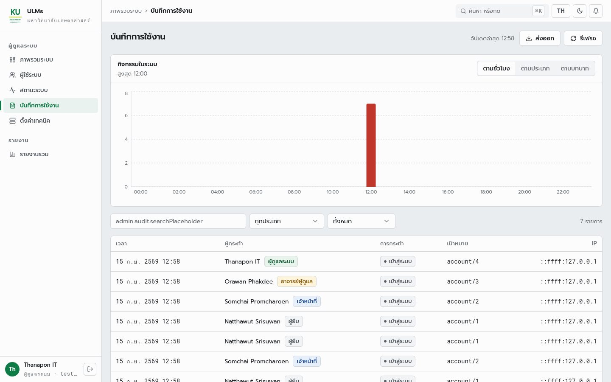

*หน้าบันทึกการใช้งานของผู้ดูแลระบบ ช่องค้นหาแสดง `admin.audit.searchPlaceholder` ตรง ๆ เพราะคีย์นี้ไม่มีในไฟล์ภาษาทั้งไทยและอังกฤษ (F16)
คีย์ที่โค้ดใช้อีก 668 คีย์มีครบทั้งสองภาษา*

| `/staff/handover` | `/reports/export` |
|---|---|
| 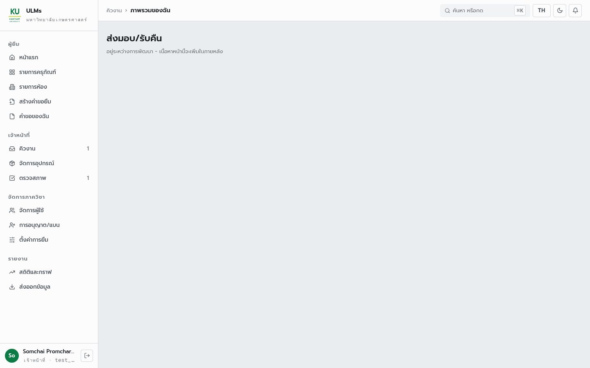 | 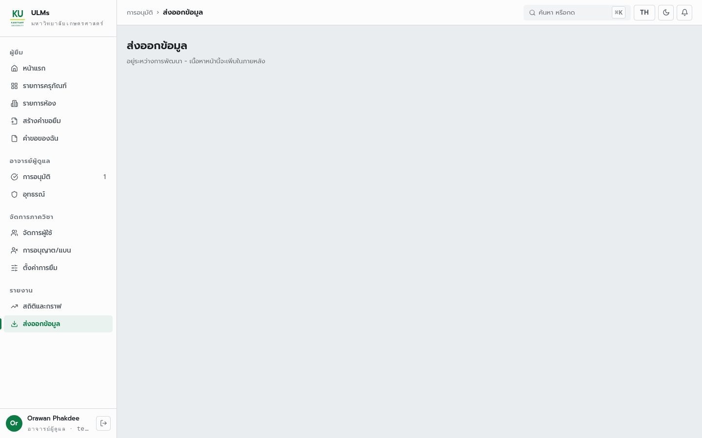 |

*หน้าที่มีเส้นทางและเมนูแล้วแต่ยังไม่มีเนื้อหา (F18)*

| ข้อ | พบ | ที่ |
|---|---|---|
| F18 | หน้ายังว่าง 2 หน้า · ข้อมูลตัวอย่าง: ห้อง 3 หน้า อุทธรณ์ 2 หน้า | `use-rooms.ts` · `use-appeals.ts` |
| F15 | ค่าหักเครดิตใช้น้ำหนักคงที่ T1=5 T2=10 ไม่ใช่น้ำหนักจริงของแต่ละชิ้น (DSLR ใน seed คือ 3) | `mock-data.ts:632` `creditCutOf` |
| F15 | tier ที่ไม่รู้จักถูกเดาเป็น T2 | `request.adapter.ts:72` · `submitted-requests.store.ts:117` |
| F22 | เมนูฝั่งผู้ยืมของเจ้าหน้าที่และอาจารย์ไม่มี "ใช้ห้อง" "รับของ" "การอุทธรณ์" ทั้งที่ยืมได้ตาม FR-AUTH-04 | `constants/navigation.ts` ส่วน `staff` และ `supervisor` |

**คำตัดสิน** **[ต้องแก้ ระดับต่ำ–กลาง]**

### 22. บันทึกการใช้งานเห็นอะไรบ้าง

`F26` · ที่มา: ตรวจเจอเพิ่ม (พบ 11 ก.ย. ยังไม่แก้) · เจ้าของงาน: BE

**แผนว่าไว้**
FR-AUTH-07 บันทึกการเข้าสู่ระบบทุกครั้ง · FR-ADM-05 *"Admin ต้องเห็น Audit Log ของการใช้งานระบบทั้งหมด"*

**ระบบทำจริง**
หลังรันการตรวจทั้งหมด ฐานข้อมูลทดสอบมีคำขอยืม 15 ใบ แต่ `AuditLog` มีแค่สามชนิด (ภาพหัวข้อ 21)

| `Action` | แถว | มาจาก |
|---|---|---|
| `login` | 30 | `auth.router.ts:74` |
| `update` | 6 | `admin.service.ts` (แบน ตั้งค่า) |
| `role` | 2 | `admin.service.ts` (เปลี่ยนบทบาท) |
| ส่งคำขอ อนุมัติ จัดเตรียม ส่งมอบ ตรวจสภาพ ลงทะเบียน | **0** | `loan` `approval` `inspection` `item` ไม่เรียก `audit.record` เลย |

**คำตัดสิน** FR-AUTH-07 **[ตรงแผน]** · FR-ADM-05 **[ต้องแก้]** ถ้ามีข้อพิพาทว่าใครอนุมัติหรือใครให้ระดับความเสียหาย ย้อนดูจากบันทึกไม่ได้

**ข้อเสนอ** BE เรียก `audit.record` ในคำสั่งที่เปลี่ยนสถานะทั้งหมดของ `loan` `approval` `inspection` และคำสั่งสร้าง/แก้ของ `item`

### 23. test ที่มีอยู่พิสูจน์อะไรได้ และอะไรยังไม่ได้

`F21` · ที่มา: รันทุกชุดบน `b1bca77` · เจ้าของงาน: ทีม test BE FE

| ชุด | ผล | ครอบคลุม |
|---|---|---|
| backend `npm test` (ฐานข้อมูลแยก) | 266/266 · 24 ชุด | unit ของ service ส่วนใหญ่ |
| frontend `typecheck` | ผ่าน | หลัง `npm ci` (โมดูลในเครื่องค้าง ไม่ใช่บั๊ก) |
| frontend `vitest` | 33/33 | catalog inventory หน้าผู้ใช้ของผู้ดูแล |
| frontend `test:ac` | 49/49 | ฟังก์ชันกฎธุรกิจ (มีข้อ 2.6 ที่ใช้กฎห้องเก่า) |
| frontend `lint` | 0 error · 7 warning | — |
| Playwright e2e | 10 ผ่าน · 1 ข้าม | ผู้ดูแลระบบ และหน้ารายการอุปกรณ์ |

> **กับดัก — ทุกชุดผ่าน แต่ไม่มีชุดใดแตะวงจรยืม**
> ไม่มี test ของ `loan` `approval` `inspection` ทั้ง unit และ e2e
> ข้อผิดพลาดใน F04 F10 F12 F17 F23 F24 จึงผ่าน test ทั้งหมดได้ สถานการณ์ S1–S5 ในเล่มนี้เขียนเป็นสคริปต์ที่รันซ้ำได้แล้ว
> ใช้เป็นต้นแบบกรณีทดสอบได้ทันที โดยแปลงค่าที่ "ผิด" ในตารางให้เป็นค่าที่ต้องการ
>
> คำตัดสิน **[ต้องแก้]**

---

## ภาค 7 สิ่งที่ต้องทำ แยกตามเจ้าของงาน

**เรียงตามลำดับที่ควรทำในแต่ละกลุ่ม เลขข้อชี้กลับไปยังหลักฐาน ระดับ: สูง = วงจรยืมหรือความถูกต้องของข้อมูลพัง · กลาง = ขัดแผน · ต่ำ = ความเรียบร้อย**

### 24. SA — ข้อความใน SRS/SDS ที่ต้องแก้ และเรื่องที่ต้องตัดสิน

| ลำดับ | งาน | ข้อ | ระดับ |
|---|---|---|---|
| 1 | ตัดสินจุดกันของ = ตั้งแต่ส่งคำขอ แก้ FR-APV-05 และข้อความในข้อเสนอ | F04 | สูง |
| 2 | ยืนยันลำดับรับของ: ผู้ยืมยืนยัน+รูป แล้วเจ้าหน้าที่ส่งมอบ (คง FR-PKP-02/03) | F05c | สูง |
| 3 | แก้ FR-RTN-01 เจ้าหน้าที่ถ่ายรูปตอนรับคืน | F05b | สูง |
| 4 | แก้ FR-REQ-08 เป็น 30 นาที × 6 ช่อง · FR-EQP-04 ความยาวช่องเป็นค่ากลาง จองทั้งห้อง | F02 F10 | สูง |
| 5 | เพิ่ม FR ปฏิทินช่วงวันสำหรับอุปกรณ์ในหมวด BRW | F01 | สูง |
| 6 | แก้ FR-EQP-03, FR-EQP-06, FR-PKP-01 ตาม T1 ไม่มี serial · ตัด FR-PKP-04 | F05d F06 | กลาง |
| 7 | เพิ่ม FR ผู้อนุมัติ T3 = เจ้าหน้าที่ | F11 | กลาง |
| 8 | ตัดสิน FR-CRD-06 (เครดิตคำนวณจากโทษที่ยัง active) · แก้ SDS v1.1 ที่เขียนการระงับการยืมไว้ตามโค้ด | F17 | กลาง |
| 9 | ตัดสินการต่ออายุ D2–D3 และ T3 (ค้างจาก SDS v1.1) | F20 | กลาง |
| 10 | ใช้ตาราง "หลังแก้" ในหัวข้อ 18 เป็นเกณฑ์ตรวจความสามารถใหม่ | F19 | กลาง |

### 25. BE-lead — โครงสร้างฐานข้อมูล

| ลำดับ | งาน | ข้อ | ระดับ |
|---|---|---|---|
| 1 | `RoomInfo.Capacity` (และเวลาเปิด–ปิดถ้าไม่ใช้ค่ากลาง) | F02 | สูง |
| 2 | ที่เก็บเหตุผลการปฏิเสธแยกจากเหตุผลผู้ยืม (ถ้าเลือกเพิ่มคอลัมน์) | F17 | ต่ำ |
| 3 | ถ้าเลือกเก็บสิทธิ์ยืมระดับประเภทแทนระดับชิ้น | F24 | กลาง |

ไม่ต้องเพิ่มตาราง slot (หัวข้อ 16) ไม่ต้องเพิ่มสถานะส่งมอบ (หัวข้อ 9) และไม่ต้องเพิ่มตารางรูป

### 26. Back-End

| ลำดับ | งาน | ข้อ | ระดับ |
|---|---|---|---|
| 1 | ฟังก์ชัน "ว่างในช่วง" ชุดเดียว ใช้ทุกตัวนับ + query ปฏิทินรายวัน | F04 F01 F09 | สูง |
| 2 | `allocate` ห้ามเปลี่ยนเครื่อง T2 | F12 | สูง |
| 3 | คำสั่งผู้ยืมยืนยันรับ+รูป · `confirmPickup` ต้องมีรูปก่อน · `requestUpload` ตามจุดประสงค์ | F05c F13 | สูง |
| 4 | `recordReturn` รับรูป | F05b | สูง |
| 5 | กฎห้องใน `loan.create` + query `roomSlots` | F03 F10 | สูง |
| 6 | เปิดสิทธิ์จองห้อง · `createUnit` นับเลขต่อและคัดลอกสิทธิ์ · T1 ไม่บังคับ serial | F23 F24 F06 | สูง |
| 7 | ลบการแบนการยืมที่ไม่มีในแผน · ป้ายสถานะไม่ใช้ "ถูกระงับ" · ไม่เขียนทับเหตุผลผู้ยืม | F17 F25 | กลาง |
| 8 | router อุทธรณ์ | F18 F19 | กลาง |
| 9 | `audit.record` ในวงจรยืม | F26 | กลาง |
| 10 | `createType` ตรวจหน่วยงาน · ตัดสถานะ `preparing` | F13 F08 | ต่ำ |

### 27. Front-End

| ลำดับ | งาน | ข้อ | ระดับ |
|---|---|---|---|
| 1 | ต่อ `loan.create` `loan.cancel` `loan.requestExtension` เลิกใช้ที่เก็บในหน่วยความจำ | F07 | สูง |
| 2 | ใช้สัญญาที่ generate จาก backend | F14 | สูง |
| 3 | หน้าลงทะเบียนอุปกรณ์/ห้อง ครบสามขั้น + ปุ่มเพิ่มจำนวน | F06 | สูง |
| 4 | ปฏิทินช่วงวันในหน้าสร้างคำขอ ป้ายของว่างใช้ช่วงที่เลือก | F01 F09 | สูง |
| 5 | หน้ารับของต่อคำสั่งยืนยันรับ · ลบปุ่มขอเปลี่ยนชิ้น · คิวงานแสดงสถานะยืนยัน | F05c F05d | สูง |
| 6 | รับคืนพร้อมถ่ายรูป · หน้าตรวจสภาพเทียบรูปก่อน/หลัง | F05b | สูง |
| 7 | หน้าห้องใช้ข้อมูลจริง ลบค่าคงที่ห้องเก่าและแก้ `test:ac` 2.6 | F03 F10 F18 | กลาง |
| 8 | หน้าอุทธรณ์สองหน้าต่อ router ใหม่ | F18 | กลาง |
| 9 | น้ำหนักเครดิตจริง · ไม่เดา T2 · แสดง `returned` เป็นรอตรวจสภาพ | F15 F08 | ต่ำ |
| 10 | คีย์ข้อความที่หาย · เมนูฝั่งผู้ยืมของเจ้าหน้าที่/อาจารย์ · หน้าส่งมอบและส่งออกที่ว่าง · เอาหน้า "การอนุญาต/แบน" ออก | F16 F22 F18 F17 | ต่ำ |

---

## ภาคผนวก

### ก. FR ที่มีปัญหาหรือต้องแก้

เฉพาะ FR ที่ผลตรวจในเล่มนี้แตะถึง จาก 86 ข้อใน SRS v1.0 ช่อง "ทาง" บอกว่าต้องแก้ระบบให้ตรง FR หรือแก้ FR ให้ตรงข้อตัดสิน

| FR | ระดับ | ปัญหา | ข้อ | ทาง |
|---|---|---|---|---|
| FR-EQP-01 | สูง | ไม่มีหน้าจอลงทะเบียน · สิทธิ์ต้องตั้งแยก | F06 | แก้ระบบ |
| FR-EQP-03 | สูง | T1 นับจำนวนแต่ backend บังคับ serial · ข้อความ "ผูก serial" ขัดข้อตัดสิน | F06 | แก้ทั้งคู่ |
| FR-EQP-04 | สูง | ไม่มีที่นั่ง เวลาเปิด · ความยาวช่องเป็นค่ากลางแล้ว | F02 | แก้ทั้งคู่ |
| FR-EQP-06 | กลาง | ประวัติรายชิ้น T1 ทำไม่ได้เมื่อไม่มี serial | F06 | แก้ FR |
| FR-EQP-07 | สูง | วันที่พร้อมให้ยืมคิดจากจำนวน "ตอนนี้" | F04 F01 | แก้ระบบ |
| FR-EQP-08 | กลาง | จำหน่ายของ `NOT_IMPLEMENTED` | F19 | แก้ระบบ |
| FR-BRW-03 | สูง | จำนวนคงเหลือสองหน้าจอไม่เท่ากัน | F04 | แก้ระบบ |
| FR-BRW-05 | สูง | ช่องเวลาห้องเป็นค่าสมมติ | F03 | แก้ระบบ |
| FR-REQ-01–10 | สูง | ปุ่มส่งคำขอไม่ถึง backend | F07 | แก้ระบบ |
| FR-REQ-03 | สูง | หน้าจอตรวจของคงเหลือกับจำนวนตอนนี้ | F09 | แก้ระบบ |
| FR-REQ-07 | สูง | serial T2 ที่อนุมัติถูกเปลี่ยนตอนจัดเตรียมได้ | F12 | แก้ระบบ |
| FR-REQ-08 | สูง | รายชั่วโมง 2 สล็อต ขัดข้อตัดสิน · backend ไม่บังคับกฎ | F10 | แก้ทั้งคู่ |
| FR-RSV-02 | กลาง | backend รับจองห้องล่วงหน้า | F10 | แก้ระบบ |
| FR-APV-05 | สูง | จุดกันของขัดกับ SDS และข้อเสนอ | F04 | แก้ FR |
| FR-PKP-01 | สูง | เลือก serial T1 ขัดข้อตัดสิน | F06 | แก้ FR |
| FR-PKP-02/03 | สูง | ผู้ยืมยืนยัน/อัปโหลดรูปไม่ได้ | F05c | แก้ระบบ |
| FR-PKP-04 | กลาง | ขัดข้อตัดสินเปลี่ยนนอกระบบ | F05d | แก้ FR |
| FR-RTN-01 | สูง | ผู้ยืมถ่ายรูปคืน ขัด BPMN และข้อเสนอ | F05b | แก้ FR |
| FR-RTN-02 | สูง | ไม่มีรูปให้เทียบ | F05b F05c | แก้ระบบ |
| FR-APL-01–06 | สูง/กลาง | ไม่มี router อุทธรณ์ | F18 | แก้ระบบ |
| FR-CRD-06 | สูง | เครดิตถูกลบตรง ไม่คำนวณจากโทษที่ active | F17 | ต้องตัดสิน |
| FR-CRD-08 | สูง | มีการแบนการยืมที่ SRS ไม่มี (โทษตามแผนมีผลผ่านแถบเครดิตเท่านั้น) | F17 F25 | แก้ระบบ |
| FR-AUTH-05 | สูง | `createType` ไม่ตรวจหน่วยงาน | F13 | แก้ระบบ |
| FR-ADM-05 | กลาง | บันทึกไม่มีการยืม อนุมัติ ตรวจ | F26 | แก้ระบบ |
| FR-RNW-04/06 | กลาง/สูง | การต่ออายุ T3 และ D2–D3 ต่างจากโค้ด | F20 | ต้องตัดสิน |

### ข. ผลรันสถานการณ์และภาพหน้าจอฉบับเต็ม

| สถานการณ์ | ครั้ง | ทำอะไร | ใช้ในหัวข้อ |
|---|---|---|---|
| S1 `s1_counters` | 37 | T1 3 ชิ้น เดินทุกสถานะ อ่านตัวนับ 3 จุดหลังทุกขั้น | 2 3 |
| S2 `s2_overlap` | 14 | ของชิ้นเดียว 5 ช่วงเวลา สองผู้ยืม | 5 |
| S3 `s3_rooms` | 13 | ห้องใหม่ สิทธิ์จอง 8 คำขอที่ผิดกฎต่างกัน | 16 17 |
| S4 `s4_handover` | 20 | T2 สองเครื่อง อนุมัติ จัดเตรียมผิดเครื่อง ส่งมอบ ตรวจสภาพ สิทธิ์ 403 | 7 8 19 |
| S5 `s5_registration` | 25 | ลงทะเบียนตาม tier จำนวน serial และการเพิ่มชิ้น | 1 |

ภาพหน้าจอ 16 ภาพ (`docs/figures/audit/`):
- ผู้ยืม: `b-catalog` `b-detail-t1` `b-request` `b-request-mobile` `b-rooms` `b-room-booking` `b-pickup` `b-my-loans`
- เจ้าหน้าที่: `s-queue` `s-inventory` `s-inspection` `s-handover-placeholder`
- อาจารย์: `v-approvals` `v-appeals-mock` `v-export-placeholder`
- ผู้ดูแลระบบ: `a-audit`

ข้อมูลที่สคริปต์ใส่ไว้ก่อนถ่าย (คำขอ T1 ที่จัดเตรียมแล้ว ของ T0 ที่รับคืนแล้ว คำขอ T2 รออนุมัติ) อยู่ใน `results/screens.json`

### ค. วิธีรันการตรวจซ้ำ

ต้องมี container Postgres ของทีมชื่อ `postgres` และ `backend/.env` ตาม `backend/README.md`
ฐานข้อมูลที่ใช้ตรวจแยกจากฐาน `app` ปกติ ไม่ทับข้อมูลเดิม

```bash
# 1. fresh audit database (backend must be stopped first)
docker exec postgres psql -U postgres -c "DROP DATABASE IF EXISTS ulms_audit WITH (FORCE)" \
                                      -c "CREATE DATABASE ulms_audit"
cd backend
export DATABASE_URL="postgresql://postgres:<password>@localhost:5432/ulms_audit"
npx prisma migrate deploy && npm run seed
npm run start                                   # :3000, keep running

# 2. frontend
cd ../frontend && npm ci && npm run dev         # :5173

# 3. evidence, in this order (screens first, or AUDIT-* items show up in the catalogue shots)
python3 -m venv /tmp/audit-venv && /tmp/audit-venv/bin/pip install playwright requests
/tmp/audit-venv/bin/playwright install firefox
/tmp/audit-venv/bin/python docs/audit/capture_screens.py
/tmp/audit-venv/bin/python docs/audit/api_scenarios.py        # or: ... api_scenarios.py s1 s3

# 4. team test suites (backend on a separate database)
DATABASE_URL=".../ulms_test" npm test
cd frontend && npm run typecheck && npm test && npm run test:ac && npm run lint
cd .. && npm ci && npx playwright install chromium && npx playwright test

# 5. the PDF version of this document
cd docs && latexmk web-audit.tex && cp build/web-audit.pdf report/
```

ตัวเลขในเนื้อความทุกตัวมาจาก `docs/audit/results/*.json` ถ้ารันซ้ำบน commit ใหม่แล้วค่าเปลี่ยน ต้องแก้ตารางในเล่มตาม
ชื่อของที่สคริปต์สร้างมีรหัสรอบ (เช่น `AUDIT-S1 ... 09151258`) จึงรันซ้ำบนฐานเดิมได้โดยไม่ชนกัน

### ง. รายการแก้ SRS/SDS รายข้อ

| ข้อ | ข้อความเดิม | ข้อความที่เสนอ |
|---|---|---|
| FR-REQ-08 | สำหรับคำขอ T3 Borrower ต้องเลือกสล็อตเวลาเป็นรายชั่วโมง จองพร้อมกันได้สูงสุด 2 สล็อต | สำหรับคำขอ T3 Borrower ต้องเลือกช่องเวลาช่องละ 30 นาที ต่อเนื่องกันไม่เกิน 6 ช่องต่อการจองหนึ่งครั้ง |
| FR-EQP-04 | ... พร้อมกำหนดจำนวนที่นั่ง ความยาวสล็อต และช่วงเวลาเปิดใช้ | ... พร้อมกำหนดจำนวนที่นั่งและช่วงเวลาเปิดใช้ ความยาวช่องเวลาเป็นค่ากลาง 30 นาที การจองเป็นแบบทั้งห้อง |
| FR-EQP-03 | สำหรับอุปกรณ์ T1 ระบบต้องรองรับการนับเป็นจำนวน (quantity) และผูก Serial Number ตอน allocation | สำหรับอุปกรณ์ T1 ระบบต้องรองรับการนับเป็นจำนวน (quantity) โดยไม่ต้องมี Serial Number |
| FR-EQP-06 | ... รายชิ้นสำหรับ T1-T2 | ... รายชิ้นสำหรับ T2 |
| FR-PKP-01 | Staff ต้องสามารถเลือก Serial Number ของอุปกรณ์ T1 ตอนจัดเตรียม และบันทึกลงในระบบ | ตัดข้อนี้ (T1 ไม่มี serial) |
| FR-PKP-02 | Borrower ต้องยืนยันการรับอุปกรณ์และตรวจสอบ Serial Number ก่อนกดยืนยัน | คงเดิม และเพิ่ม: Staff บันทึกการส่งมอบได้หลัง Borrower ยืนยันแล้วเท่านั้น |
| FR-PKP-04 | สำหรับ T1 Borrower ต้องสามารถขอเปลี่ยนอุปกรณ์ตอนรับได้หากพบปัญหา | ตัดข้อนี้ หรือ: การเปลี่ยนชิ้น T1 ทำที่จุดบริการโดยไม่บันทึกในระบบ |
| FR-RTN-01 | Borrower ต้องสามารถแจ้งคืนผ่านระบบพร้อมอัปโหลดรูปถ่ายตอนคืน | Staff ต้องบันทึกการรับคืนพร้อมอัปโหลดรูปถ่ายอุปกรณ์ตอนคืน |
| FR-APV-05 | เมื่อคำขอได้รับการอนุมัติ ระบบต้องสร้าง Allocation ... | ระบบต้องกันอุปกรณ์ในช่วงเวลาที่ขอตั้งแต่รับคำขอ และคงไว้เมื่ออนุมัติ พร้อมกำหนด pickup_deadline 24 ชั่วโมง |
| ใหม่ BRW | — | สำหรับ T0–T2 ระบบต้องแสดงปฏิทินให้เลือกช่วงวันยืม วันที่อุปกรณ์ว่างไม่พอต้องเลือกไม่ได้ |
| ใหม่ APV | — | คำขอ T3 ต้องได้รับการอนุมัติจาก Staff ของหน่วยงานเจ้าของสถานที่ |
| FR-RNW-04/06 | (ค้างจาก SDS v1.1) | รอที่ประชุมตัดสิน ตามรายงานความก้าวหน้าครั้งที่ 3 |

SDS ที่ต้องแก้ตาม: ตารางสถานะ (ลำดับ ผู้ยืมยืนยัน → ส่งมอบ) · กรณีใช้งานส่งคำขอ (จุดกันของ และตัดการระงับการยืม) · รายการ procedure (`confirmReceipt` `roomSlots` `availabilityCalendar` `setRoomEligibility` และตัด `setUserBan`)

### จ. อภิธานศัพท์

| คำ | ความหมายในเล่มนี้ |
|---|---|
| T0 T1 T2 T3 | ระดับอุปกรณ์ตามมูลค่า: ยืมง่าย · ยืมได้ · ยืมยาก (อาจารย์อนุมัติ) · ของติดที่ คือห้อง |
| D0–D3 | แถบเครดิตของผู้ยืม กำหนดจำนวนวันยืมสูงสุดและผู้อนุมัติ |
| `Reservations` | ตารางคำขอ หนึ่งแถวต่อหนึ่งชิ้น สถานะ `Pending Approved Rejected Canceled` |
| `UsageLog` | ตารางการยืมจริง เริ่มตอนจัดเตรียม สถานะ `Prepared Lended Returned Inspected` |
| `Eligibility` | แถวที่บอกว่าบทบาทใดในหน่วยงานใดยืมชิ้นนี้ได้ ไม่มีแถว = ไม่มีใครยืมได้ |
| `BufferTime` | วันเตรียมของก่อนและหลังการยืม นับรวมตอนตรวจการจองซ้อน |
| procedure | คำสั่งหนึ่งตัวของ tRPC เช่น `loan.create` |
| seed | สคริปต์ใส่ข้อมูลตั้งต้น (บัญชีทดสอบ อุปกรณ์ 4 ประเภท 15 ชิ้น) |
| ข้อมูลตัวอย่าง (mock) | ข้อมูลที่เขียนไว้ในโค้ดหน้าจอ ไม่ได้มาจากฐานข้อมูล |
| ช่องเวลา (slot) | ช่วง 30 นาทีที่จองห้องได้ ตามข้อตัดสินของทีม |
| S1–S5 | สถานการณ์ทดสอบในภาคผนวก ข |

---

*ที่มาของตัวเลขและภาพทั้งหมด: `docs/audit/api_scenarios.py` และ `docs/audit/capture_screens.py`
รันบน `b1bca77` เมื่อ 15 ก.ย. 2569 ผลดิบอยู่ใน `docs/audit/results/` ถ้าโค้ดเปลี่ยนแล้วรันใหม่ ตัวเลขในเล่มต้องตามไปแก้*
